## Risk per full-time workers


## Ideal design for safety from the interviews
* Roof pitch: lower than 5/12 – 7/12 `to work easy - fall`
* Roof material: composition `not to be slippery - fall`
* Roof structure: no obstruction `not to be interrupted - trip, complexity`
* Roof condition: accessories pre-installed `to reduce the scope - complexity`
* Anchor point: pre-installed `to be efficient - fall`
* Access: low height, `enough space for easier access - fall`
* Additional: setback, snow guard, guardrail `fall`
* Electrical: micro inverter, conduit pre-run, reserving spaces, `electric shock, complexity`


## Solar installation trend in Seattle


## Solar installation trend by contractors


## Cumulative solar installation per census track


## Residential household in Seattle


## Residential solar potential (MWh) in Seattle


## Residential solar potential (MWh/ household) in Seattle

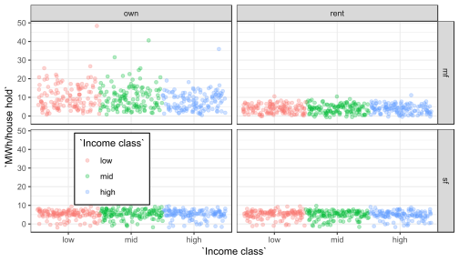


## Histograms of multiple variables


## Boxplot for overall potential solar

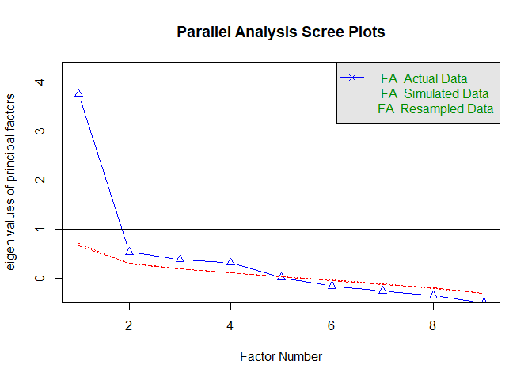


## Cor plot


## Regression


```
##
## Call:
## lm(formula = sol_instl ~ hu_med_val + hu_ex_1000, data = regr[-c(1)])
##
## Residuals:
##     Min      1Q  Median      3Q     Max
## -8.4964 -1.8188 -0.4623  1.1230 16.2559
##
## Coefficients:
##               Estimate Std. Error t value Pr(>|t|)
## (Intercept) -1.984e+00  8.119e-01  -2.444   0.0159 *
## hu_med_val   3.905e-06  1.954e-06   1.998   0.0478 *
## hu_ex_1000   1.768e+01  1.594e+00  11.094   <2e-16 ***
## ---
## Signif. codes:  0 '***' 0.001 '**' 0.01 '*' 0.05 '.' 0.1 ' ' 1
##
## Residual standard error: 2.875 on 128 degrees of freedom
## Multiple R-squared:  0.6136,	Adjusted R-squared:  0.6076
## F-statistic: 101.6 on 2 and 128 DF,  p-value: < 2.2e-16
```

## Residual from the OLS
<center>

{width=450px}

</center>

## Geographically weighted regression (GWR)
<center>

{width=450px}

</center>

## Geographically weighted impact
<center>

{width=450px}

</center>

<center>

{width=450px}

</center>

<center>

{width=450px}

</center>

<center>

{width=450px}

</center>


## Factor analysis (Parallel screen)


```
## Parallel analysis suggests that the number of factors =  3  and the number of components =  NA
```

## Factor analysis (Plot)


## Factor analysis (Diagram)

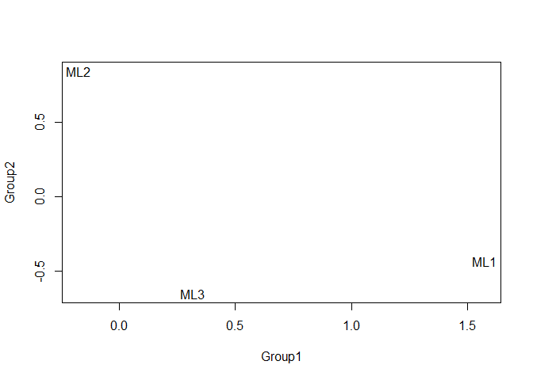

## Factor correlation for solar installation


```
## [1] 131   3
```


## Factor regression

```
##
## Call:
## lm(formula = regr[[14]] ~ dat[, 1] + dat[, 2] + dat[, 3])
##
## Residuals:
##     Min      1Q  Median      3Q     Max
## -8.4394 -1.6916 -0.5028  1.0860 16.2534
##
## Coefficients:
##             Estimate Std. Error t value Pr(>|t|)
## (Intercept)   5.0904     0.2531  20.112   <2e-16 ***
## dat[, 1]      3.3447     0.3443   9.715   <2e-16 ***
## dat[, 2]      0.6351     0.3127   2.031   0.0443 *
## dat[, 3]      0.3905     0.3147   1.241   0.2169
## ---
## Signif. codes:  0 '***' 0.001 '**' 0.01 '*' 0.05 '.' 0.1 ' ' 1
##
## Residual standard error: 2.897 on 127 degrees of freedom
## Multiple R-squared:  0.6106,	Adjusted R-squared:  0.6014
## F-statistic: 66.39 on 3 and 127 DF,  p-value: < 2.2e-16
```

## Cluster analysis

```
##
##  1  2  3
## 55 32 44
```


## Cluster within cluster sum of squares (WCSS)


```
## [1] 177.3648
```

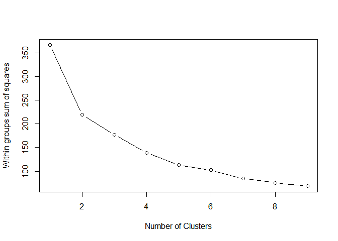

## Optimal cluster

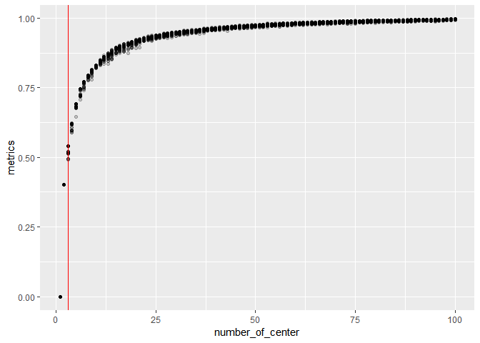

## Cluster plot
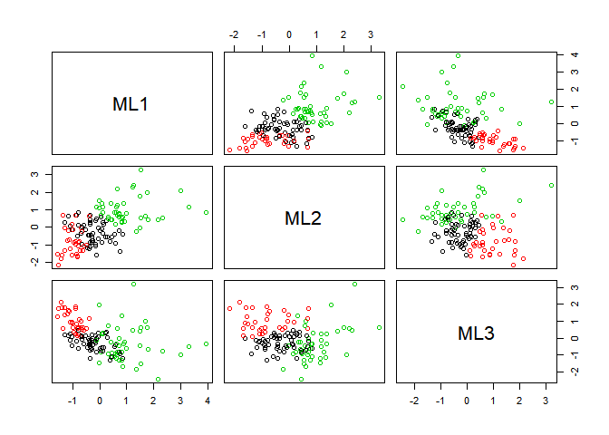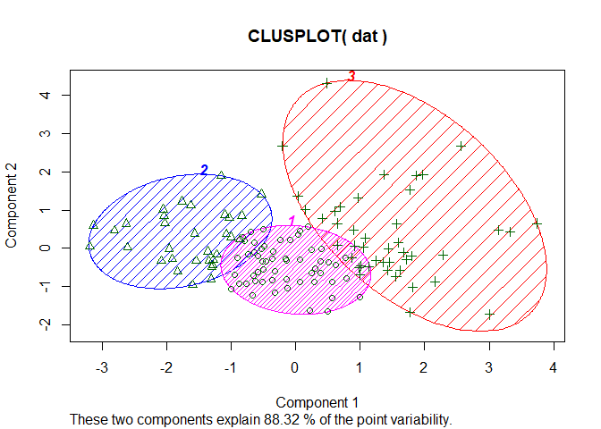

## 3D plot


## Cluster with boxplot

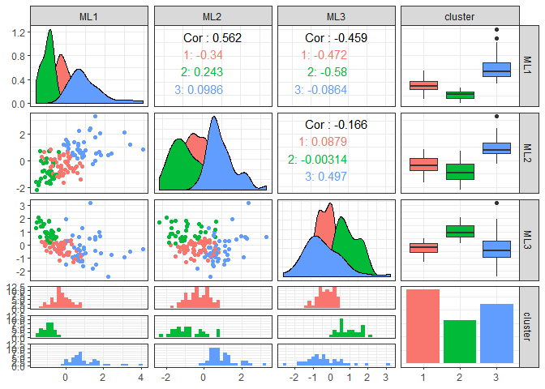

## Cluster plot with smooth

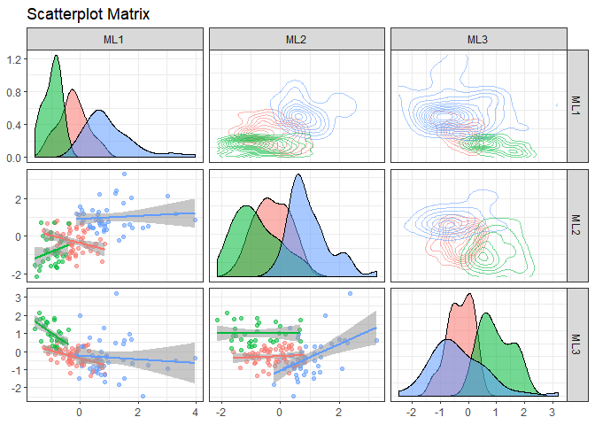

## Data analysis 1

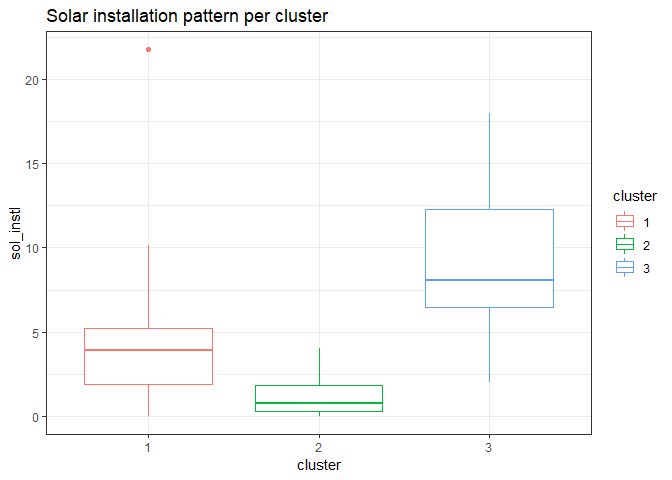


## Data analysis 2
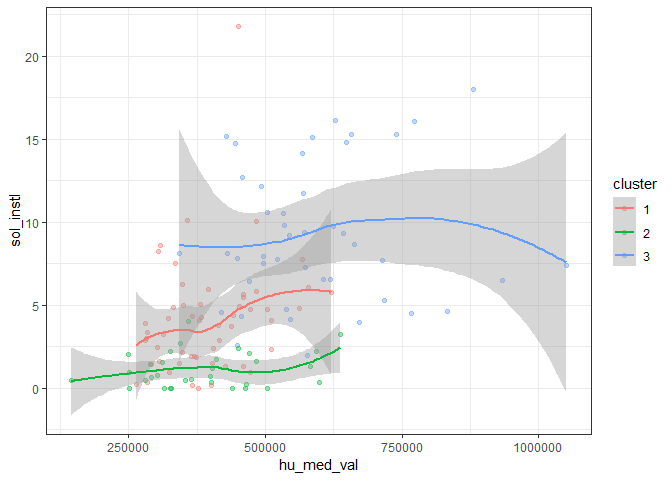

## Data analysis 3
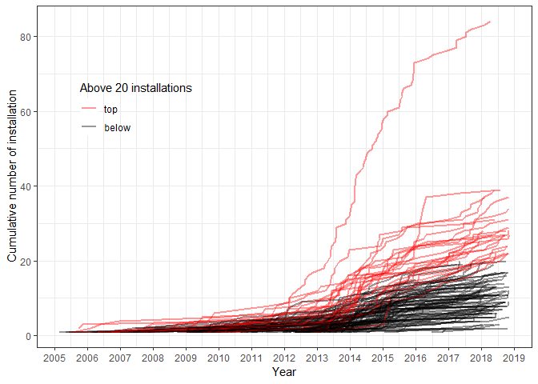

<center>

{width=450px}

</center>
