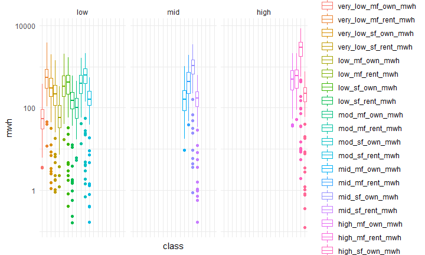
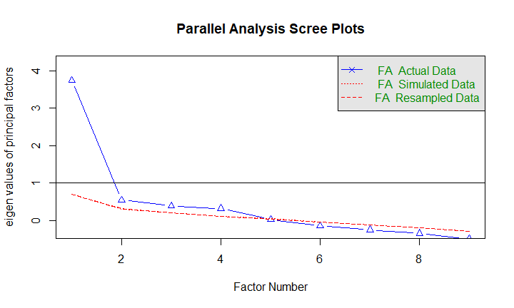
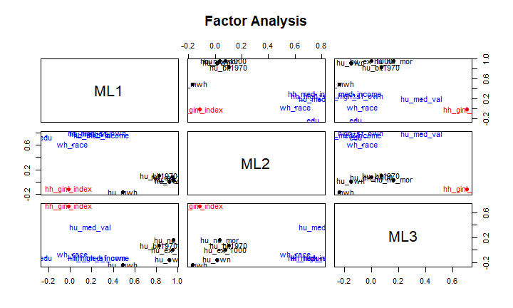
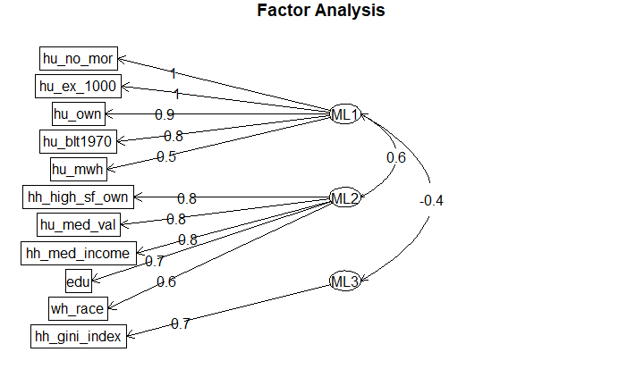
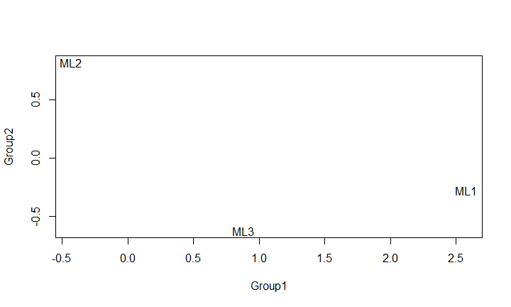
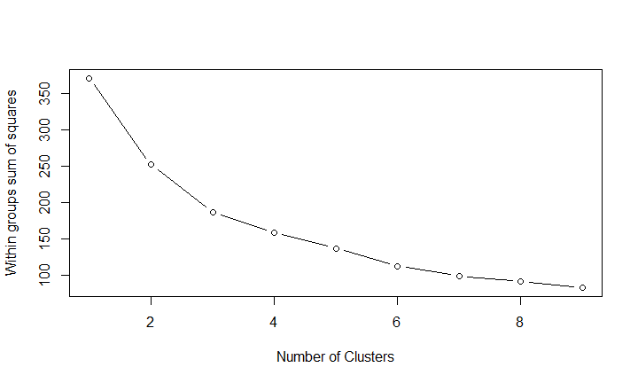
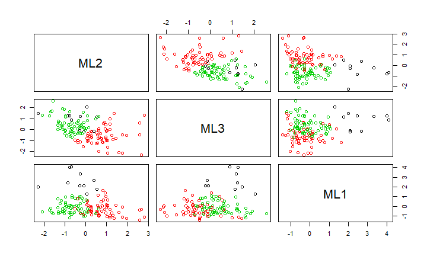
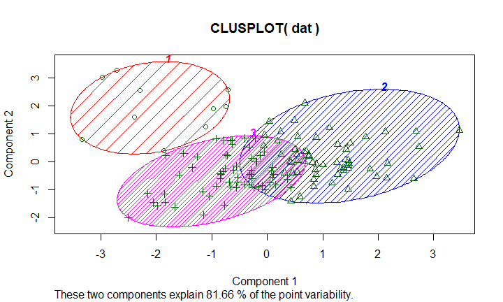

## R Markdown

This is an R Markdown presentation. Markdown is a simple formatting syntax for authoring HTML, PDF, and MS Word documents. For more details on using R Markdown see <http://rmarkdown.rstudio.com>.

When you click the **Knit** button a document will be generated that includes both content as well as the output of any embedded R code chunks within the document.

## Slide with Bullets

- Bullet 1
- Bullet 2
- Bullet 3

## Solar installation trend in Seattle

<!-- -->

## Solar installation trend by contractors 

<!-- -->


## Cumulative solar installation per census track

<!-- -->


## Residential solar potential (MWh) in Seattle

<!-- -->

## Residential solar potential (MWh/ household) in Seattle

<!-- -->


## Histograms of multiple variables 

<!-- -->

## Cor plot

<!-- -->


## Regression


```
## 
## Call:
## lm(formula = sol_instl ~ hu_rnt + hu_med_val + black, data = fin[-c(1, 
##     2, 6, 7, 8, 9)])
## 
## Residuals:
##     Min      1Q  Median      3Q     Max 
## -8.0301 -1.7673 -0.4132  1.1725 14.2792 
## 
## Coefficients:
##               Estimate Std. Error t value Pr(>|t|)    
## (Intercept)  1.415e+01  1.770e+00   7.997 6.80e-13 ***
## hu_rnt      -1.901e+01  1.692e+00 -11.236  < 2e-16 ***
## hu_med_val   8.420e-06  1.953e-06   4.311 3.23e-05 ***
## black        7.972e+00  3.218e+00   2.477   0.0146 *  
## ---
## Signif. codes:  0 '***' 0.001 '**' 0.01 '*' 0.05 '.' 0.1 ' ' 1
## 
## Residual standard error: 2.859 on 127 degrees of freedom
## Multiple R-squared:  0.6207,	Adjusted R-squared:  0.6117 
## F-statistic: 69.26 on 3 and 127 DF,  p-value: < 2.2e-16
```

## Residual from the OLS 


## Factor analysis (Parallel screen) 

<!-- -->

```
## Parallel analysis suggests that the number of factors =  4  and the number of components =  NA
```

## Factor analysis (Plot)

<!-- -->

## Factor analysis (Diagram)

<!-- -->

## Factor correlation for solar installation

<!-- -->

## Factor regression 

```
## 
## Call:
## lm(formula = fin[[16]] ~ dat[, 1] + dat[, 2] + dat[, 3])
## 
## Residuals:
##     Min      1Q  Median      3Q     Max 
## -6.2962 -2.0322 -0.5817  1.5500 17.9535 
## 
## Coefficients:
##             Estimate Std. Error t value Pr(>|t|)    
## (Intercept)   5.0904     0.2919  17.441  < 2e-16 ***
## dat[, 1]      2.2605     0.3361   6.726 5.34e-10 ***
## dat[, 2]     -1.1489     0.3472  -3.309  0.00122 ** 
## dat[, 3]     -0.9088     0.3001  -3.028  0.00298 ** 
## ---
## Signif. codes:  0 '***' 0.001 '**' 0.01 '*' 0.05 '.' 0.1 ' ' 1
## 
## Residual standard error: 3.34 on 127 degrees of freedom
## Multiple R-squared:  0.4823,	Adjusted R-squared:   0.47 
## F-statistic: 39.44 on 3 and 127 DF,  p-value: < 2.2e-16
```

## Kmeans

```
##          ML2        ML3        ML1
## 1 -0.4289458  0.8822497  2.5790644
## 2  0.8218458 -0.6197500 -0.2747965
## 3 -0.6885333  0.4305238 -0.1563880
```

```
## 
##  1  2  3 
## 10 58 63
```

<!-- -->

## Cluster within cluster sum of squares (WCSS)


```
## [1] 251.739
```

<!-- -->

## Cluster plot
<!-- --><!-- -->

## 3D plot


