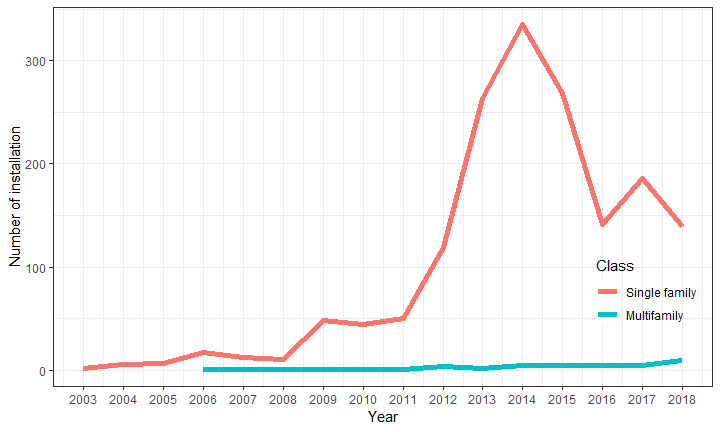
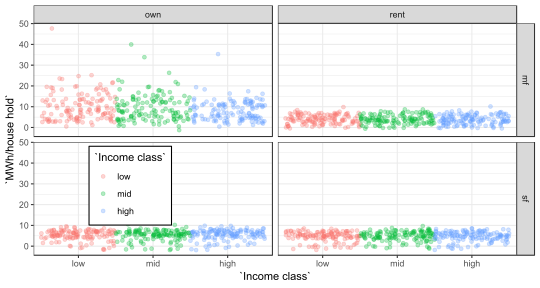
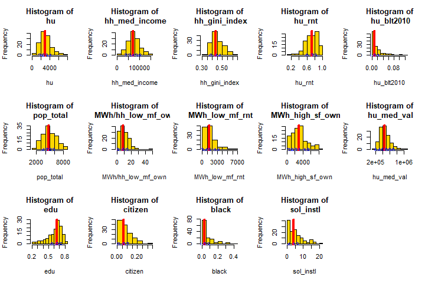
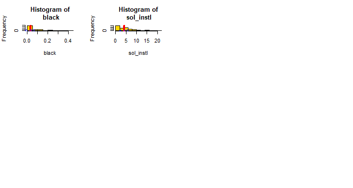

## R Markdown

This is an R Markdown presentation. Markdown is a simple formatting syntax for authoring HTML, PDF, and MS Word documents. For more details on using R Markdown see <http://rmarkdown.rstudio.com>.

When you click the **Knit** button a document will be generated that includes both content as well as the output of any embedded R code chunks within the document.

## Slide with Bullets

- Bullet 1
- Bullet 2
- Bullet 3

## Solar installation trend in Seattle

<!-- -->

## Solar installation trend by contractors 

<!-- -->

## Cumulative solar installation per census track

<!-- -->

## Residential solar potential (MWh) in Seattle

<!-- -->

## Residential solar potential (MWh/ household) in Seattle

<!-- -->

## Histograms of multiple variables 

<!-- --><!-- -->

