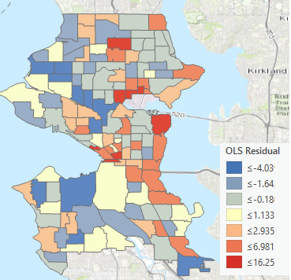
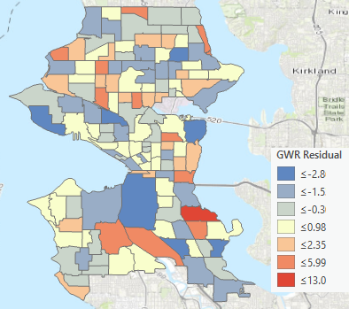
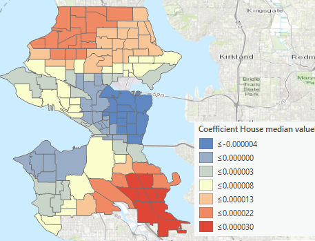
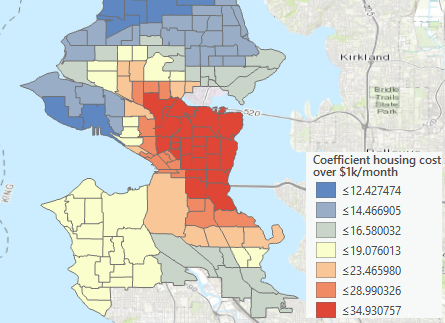
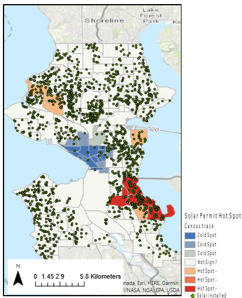
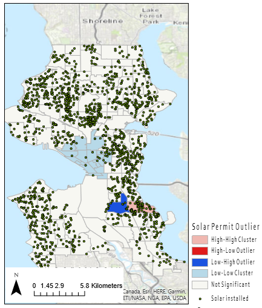
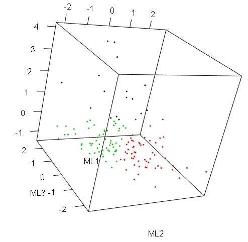
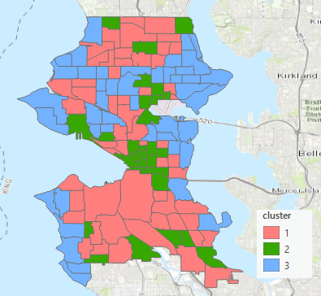
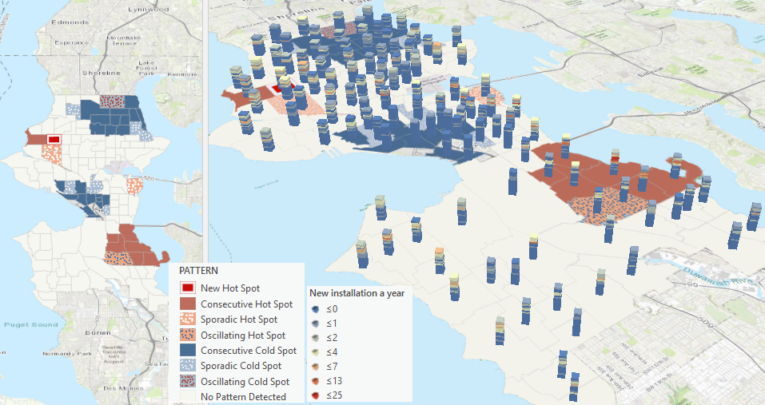
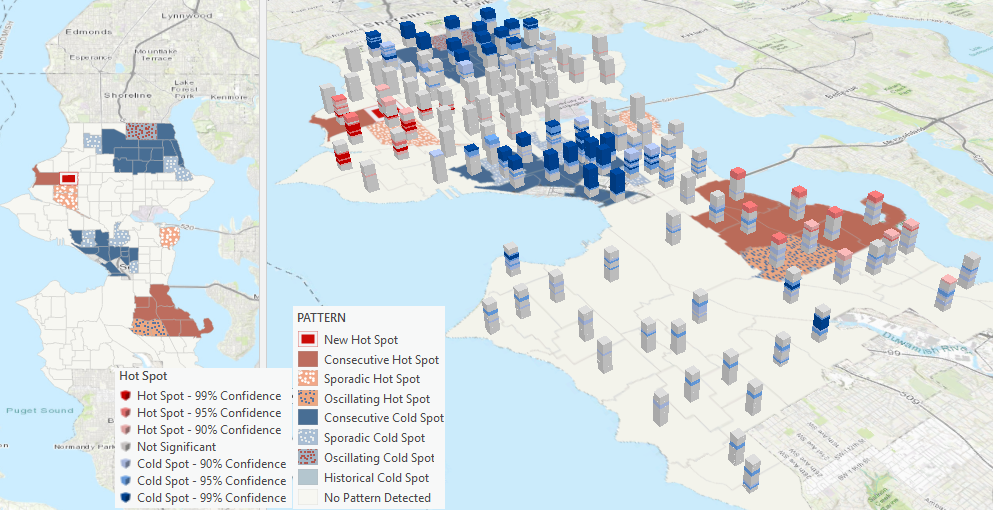

```{r setup, include=FALSE, echo= F}
knitr::opts_chunk$set(echo = FALSE, warning= F, message= F, fig.align="center")
library(tidyverse) # includes all the packages below 
# library(readr)
# library(dplyr)
# library(tidyr)
# library(ggplot2)
# library(tibble)
# library(forcats)
# library(stringr)
library(lubridate)
library(pander)
library(psych)
library (cluster)
library(reshape)
library(reshape2)
library(som)
library(GPArotation)
library(corrplot)
library(GGally)
# library(MASS)
library(faraway)
library(sjPlot)
```


## Solar installation trend in Seattle

> Why is there a drop in residential solar installation in Seattle from 2016? The study area is Seattle and the unit of analysis is census track.

```{r load data}

load("../data/derived/iv.Rdata")
load("../data/derived/dv.Rdata")
load("../data/derived/ts.Rdata")
load("../data/derived/reg.Rdata")
```

```{r}

g_pvtren_dv

```

## Solar installation trend by contractors

```{r}
g_pvcontr_dv
```


## Residential households in Seattle

```{r}
g_hh_iv
```


## Residential solar potential (MWh/ household) in Seattle

```{r}
g_mwhu_iv
```

## Residential solar potential (MWh) in Seattle

> There are two noticeable groups in social characteristics with solar potential (MWh): A group of high income, single family housing owners and a group of low income, multifamily housing renters. These two groups have comparatively higher potential for solar electricity generation.

```{r}
g_mwh_iv
```

## Boxplot for overall potential solar

```{r}
seattle %>%
  gather(class, mwh, very_low_mf_own_mwh:high_sf_rent_mwh) %>%
  select(geoid, class, mwh) %>%
  mutate(class = parse_factor(class, levels = names(seattle))) %>%
  mutate(cl = ifelse(str_detect(class, "verylow|low|mod"), "low",
                                 ifelse(str_detect(class, "mid"), "mid",
                                        ifelse(str_detect(class, "high"), "high", NA)))) %>%
  mutate(cl = parse_factor(cl, levels = c("low", "mid", "high"))) %>%
  ggplot(aes(x = class, y = mwh, color = class)) +
  geom_boxplot() +
  facet_wrap( ~ cl) +
  scale_y_log10() +
  theme_minimal() +
  theme(axis.text.x = element_blank(),
      axis.ticks.x = element_blank())
```

## Histograms of multiple variables

> Variables are collected through several datasets including `National Renewable Energy Laboratory (NREL) REPLICA 2018`, `American Community Survey (ACS) 2011 - 2015`, `the Department of Housing and Urban Development (HUD) 2017` and `City of Seattle open data portal`.

```{r, fig.height=5}
source("../syntax/dv_table.R")
```

## Cor plot

> The proportion of solar installation per housing unit is the dependent variable (`sol_instl`) per census track. Rest of variables are as follows.

> * `hu_own`: a proportion of owner-occupied housing units
> * `hu_blt1970`: a proportion of housing units built before 1970
> * `hu_no_mor`: a proportion of housing units without a mortgage
> * `hu_med_val`: median value of owner-occupied housing units 
> * `hu_ex_1000`: a proportion of owner-occupied units with housing costs greater than $1000/month
> * `edu`: a proportion of over 25 year old population with college degree and above
> * `hh_med_income`: household median income
> * `hh_gini_index`: household GINI Index of income inequality
> * `lihtc`: low income tax credit qualification (T/F)

> The dependent variable (`sol_instl`) is correlated to all the variables except for the household GINI index and LITHC qualification.

```{r}
### cor plot

corrplot(cor(regrs_p), method = "ellipse")
```


## Regression

> By exploratory regression analyses, the best model with the highest **R-squared (0.61)** and lowest **AIC (653.69)** was chosen with the two variables, `hu_med_val` and `hu_ex_1000` through OLS.

```{r}
va_lm_re
```

## Residual from the OLS

> The residual plot shows it is biased and clustered indicating the model is not catching well the variability of the dependent variable.

<center>

{width=450px}

</center>

## Geographically weighted regression (GWR)

> Another method named Geographically Weighted Regression (GWR) was performed with the outcomes of **R-squared (0.76)** and **AIC (625.54)**, which are better than the previous OLS model. Residual map shows random pattern as confirmed by auto correlation analysis with **Moran's index of 0.028** and **z-score of 0.75**.

<center>

{width=450px}

</center>

## Geographically weighted impact

> This model tells that the median value of owner-occupied housing units predicts residential solar installation more in the area of darker red as below. These areas are more sensitive to the median value of owner-occupied housing units with respect to the residential solar installation.

<center>

{width=450px}

</center>

> For the variable, total number of owner-occupied units with housing costs greater than $1000/month, the more sensitive areas are presented as darker red in the map below.

<center>

{width=450px}

</center>

## Hotspot analysis of residential solar installation

> Each point represents the house unit with residential solar system installed on its building since 2003. By aggregating these points to the census track they are located in, hotspot areas and outliers were identified as below.

<center>

{width=450px}

</center>

<center>

{width=450px}

</center>


## Factor analysis (Parallel screen)

> It would be useful to include all the variables for a model rather than selecting only two variables. With a factor analysis, all the variables would be used for the model identification. The parallel screen confirms 2 or 3 factors would be appropriate.

```{r}

fa.parallel(fct,fa="fa",n.iter=50)
```

## Factor analysis (Plot)

> The 3 factors partially explain each variable depending on the latent characteristics.

```{r}

factor.plot(fa, labels=rownames(fa$loadings))
```

## Factor analysis (Diagram)

> The first factor (`ML1`) is more related to the higher housing stability (homeownership), the 2nd factor (`ML2`) to the higher economic status, and the 3rd factor (`ML3`) is more related to the higher income inequality.

```{r}
fa.diagram(fa,simple=T)
```

## Factor correlation for solar installation

> The most loaded, `ML1` is positively correlated with the solar installation variable.

```{r}
plot(dat[,1], regrs[[14]], xlab = "The 1st factor", ylab = "Solar installation")
abline(lm(regrs[[14]] ~ dat[,1]), col = "red")
```

## Factor regression

> The value of R-squared of the factor regression is the same as the previous OLS **(0.61)**.

```{r}
fa_lm_re
```


## Cluster within cluster sum of squares (WCSS)

> A cluster analysis was done to further study the featured census tracks. It shows clustering three would be appropriate.

```{r}
plot(1:9, wss, type="b", xlab="Number of Clusters",ylab="Within groups sum of squares")

```

```{r}
g_perf_re
```


## Cluster analysis

> Based on the 3 factors, 3 clusters are presented in colors.

```{r}
clusplot(dat, kme$cluster, color=TRUE,shade=TRUE, labels=5, lines=0)
```

## 3D plot
```{r}
# library(rgl)
# plot3d(fa$scores, col = kme$cluster)
```



## 3 clusters in Seattle

> Each census track in Seattle was identified with the 3 clusters.

<center>

{width=450px}

</center>


## Cluster with boxplot

> Each cluster shows unique features. Green groups comparatively have less housing stability and economic status while higher income inequality. Light blue groups are relatively opposite to the green groups. Light red groups keep their position in the middle of these 2 groups.

```{r}
g_pair_re 
```

## Cluster plot with smooth

```{r}
g_pair1_re
```

## Residential solar installation pattern in terms of clustering groups

> Residential solar installation is exactly showing the same pattern of the 1st factor (`ML1`), the housing stability in clustering, which confirms the factor, `ML1` has a predictive power for the residential solar installation. 

```{r}
g_sol_re

```


## Residential solar installation in Low Income Tax Credit

> It indicates that lower solar installation proprotion and lower proportion of owner-occupied units with housing costs greater than $1000/month match the pattern of the certified LIHTC census tracks (TRUE).

```{r}

g_ef1_re
```

## Residential solar installation in housing unit median value

> Solar installation is correlated with the median value of owner-occupied housing units in general. But if separated by clusers, it shows lower correlations for each cluster. Cluster #3, #1 and #2 in order are more likely to have higher solar installation.


```{r}
g_ef2_re
```


## Cumulative solar installation per census track

> Time series analysis will help to understand the spatial-temporal pattern of residential solar installation in Seattle. Interestingly, one census track is noticeably high in installation over the period.

```{r}
g_ts_ts
```

## Residential solar installation trend in Seattle

> Two different patterns of cumulative installation and annual new installation, are mapped in each census track in Seattle. It shows the pattern of cumulative number of installation is different from the annual new installation in that every year has a different installation trend depending on census tracks. In addition, hotspot outlier analysis was performed for the annual new installation map.


<center>

{width=650px}

</center>

## Spatial-temporal hotspot analysis

> The difference between cumulative number of installation hotspot and annual new installation hotspot shows the emerging area of increasing installation pattern in residential solar. It is noticeable that West Seattle recently increases the installation while Ballard used to the one, then went slow, currently increases also. Columbia city presents that it has been and currently goes slow while the toal amount installation is still the highest in Seattle. It's found that these areas are all clustered as light red (#1) and light blue (#3).

<center>

{width=650px}

</center>

<center>

{width=650px}

</center>

## Takeaways

> Residential solar installation follows patterns of

> * Median value of owner-occupied housing units
> * The number of owner-occupied house with higher housing cost

> Cluster and factor analysis captures solar installation pattern (Cluster #1 and #3) in terms of

> * **Higher housing stability (homeownership)**
> * **Higher economic status**
> * **Lower income inequality**

> Temporal pattern was also captured such that three noticeable areas were identified

> * **Ballard** – used to be a hotspot area, then went slow, currently seems increasing in solar installation
> * **West Seattle** – a new emerging area in solar installation
> * **Columbia city** – has been a hotspot but currently goes slow. The toal amount installation is still the highest in Seattle. 
