## Solar installation trend in Seattle

> Why is there a drop in residential solar installation in Seattle from 2016? The study area is Seattle and the unit of analysis is census track.


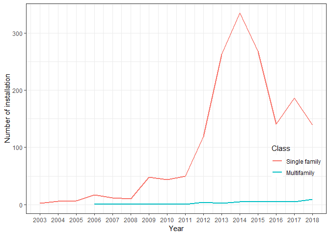

## Solar installation trend by contractors

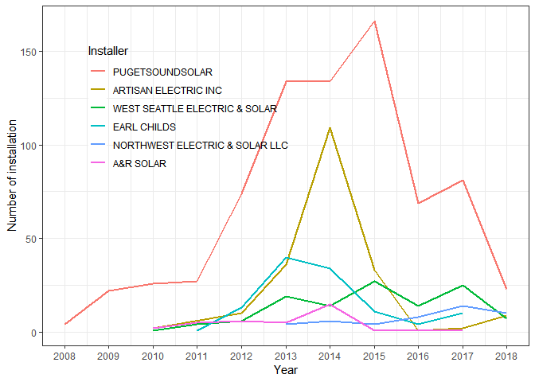


## Residential households in Seattle

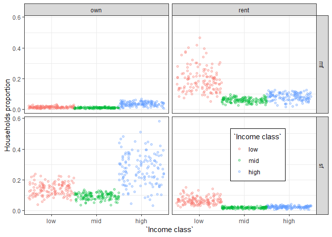


## Residential solar potential (MWh/ household) in Seattle

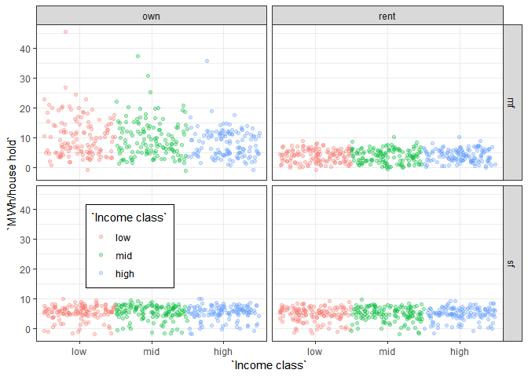

## Residential solar potential (MWh) in Seattle

> There are two noticeable groups in social characteristics with solar potential (MWh): A group of high income, single family housing owners and a group of low income, multifamily housing renters. These two groups have comparatively higher potential for solar electricity generation.

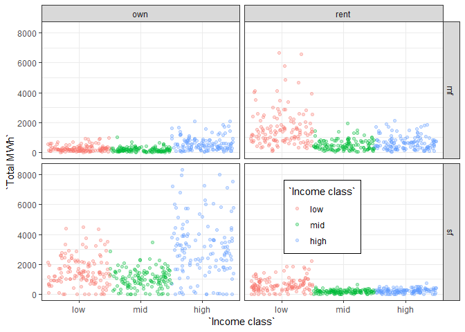

## Boxplot for overall potential solar

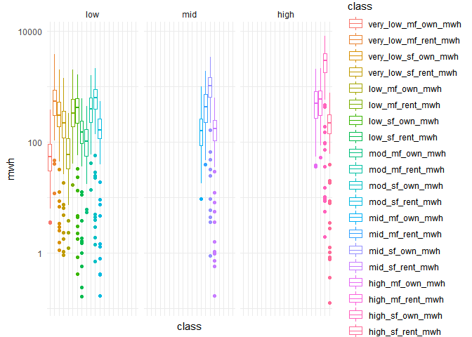

## Histograms of multiple variables

> Variables are collected through several datasets including `National Renewable Energy Laboratory (NREL) REPLICA 2018`, `American Community Survey (ACS) 2011 - 2015`, `the Department of Housing and Urban Development (HUD) 2017` and `City of Seattle open data portal`.


## Cor plot

> The number of solar installation per census track is the dependent variable (`sol_instl`). Rest of variables are as follows.

> * `hu_own`: a proportion of owner-occupied housing unit
> * `hu_blt1970`: a proportion of housing units built before 1970
> * `hu_no_mor`: a proportion of housing units without mortgage
> * `hu_med_val`: housing unit median value
> * `hu_ex_1000`: total number of owner-occupied units with housing costs greater than $1000/month
> * `edu`: a proportion of over 25 year old population with college degree and above
> * `wh_race`: a proportion of Caucasian population
> * `hh_med_income`: household median income
> * `hh_gini_index`: household GINI Index of income inequality
> * `lihtc`: low income tax credit qualification (T/F)
> * `hh_high_sf_own`: a proportion of households of high income, single family housing owner
> * `hu_mwh`: solar energy potential (MWh) per housing unit in a census track

> The dependent variable (`sol_instl`) is correlated to all the variables except for the household GINI index and LITHC qualification.

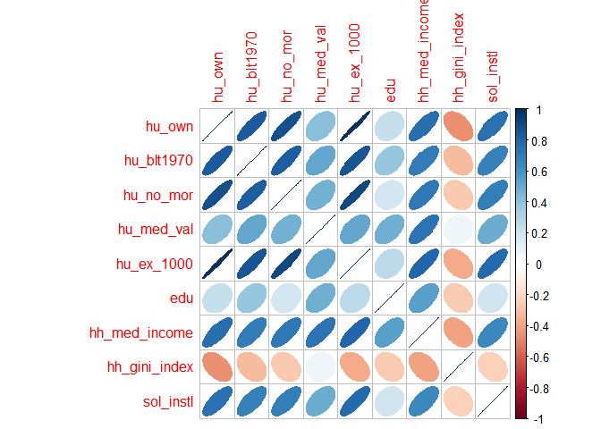


## Regression

> By exploratory regression analyses, the best model with the highest **R-squared (0.61)** and lowest **AIC (653.69)** was chosen with the two variables, `hu_med_val` and `hu_ex_1000` through OLS.


```
## 
## Call:
## lm(formula = sol_instl ~ hu_med_val + hu_ex_1000, data = regrs[-c(1)])
## 
## Residuals:
##     Min      1Q  Median      3Q     Max 
## -8.4964 -1.8188 -0.4623  1.1230 16.2559 
## 
## Coefficients:
##               Estimate Std. Error t value Pr(>|t|)    
## (Intercept) -1.984e+00  8.119e-01  -2.444   0.0159 *  
## hu_med_val   3.905e-06  1.954e-06   1.998   0.0478 *  
## hu_ex_1000   1.768e+01  1.594e+00  11.094   <2e-16 ***
## ---
## Signif. codes:  0 '***' 0.001 '**' 0.01 '*' 0.05 '.' 0.1 ' ' 1
## 
## Residual standard error: 2.875 on 128 degrees of freedom
## Multiple R-squared:  0.6136,	Adjusted R-squared:  0.6076 
## F-statistic: 101.6 on 2 and 128 DF,  p-value: < 2.2e-16
```

## Residual from the OLS

> The residual plot shows it is biased and clustered indicating the model is not catching well the variability of the dependent variable.

<center>

{width=450px}

</center>

## Geographically weighted regression (GWR)

> Another method named Geographically Weighted Regression (GWR) was performed with the outcomes of **R-squared (0.76)** and **AIC (625.54)**, which are better than the previous OLS model. Residual map shows random pattern as confirmed by auto correlation analysis with **Moran's index of 0.028** and **z-score of 0.75**.

<center>

{width=450px}

</center>

## Geographically weighted impact

> This model tells that housing unit median value affects residential solar installation more in the area of darker red as below. These areas are more sensitive to the housing unit median value with respect to the residential solar installation.

<center>

{width=450px}

</center>

> For the variable, total number of owner-occupied units with housing costs greater than $1000/month, the more sensitive area is presented as darker red in the map below.

<center>

{width=450px}

</center>

## Hotspot analysis of residential solar installation

> Each point represents the house unit with residential solar system installed on its building since 2003. By aggregating these points to the census track, hotspot areas and outliers were identified as below.

<center>

{width=450px}

</center>

<center>

{width=450px}

</center>


## Factor analysis (Parallel screen)

> It would be useful to include all the variables rather than selecting only two variables in the model. With a factor analysis, all the variables would be used for model identification. The parallel screen confirms 2 or 3 factors would be appropriate.

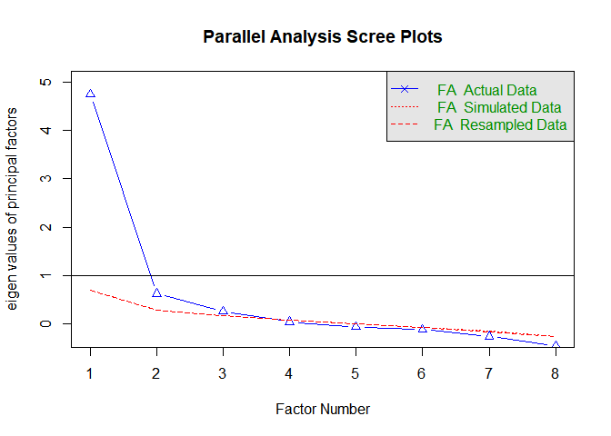

```
## Parallel analysis suggests that the number of factors =  2  and the number of components =  NA
```

## Factor analysis (Plot)

> The 3 factors partially explain each variable depending on the latent characteristics.

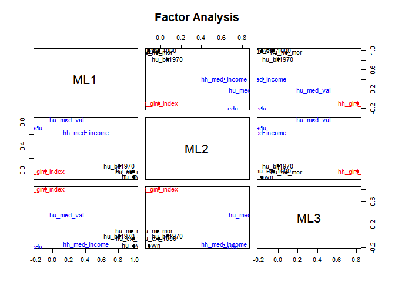

## Factor analysis (Diagram)

> The first factor (`ML1`) is more related to the higher housing stability, the 2nd factor (`ML2`) to the higher economic status, and the 3rd factor (`ML3`) is more related to the higher income inequality.

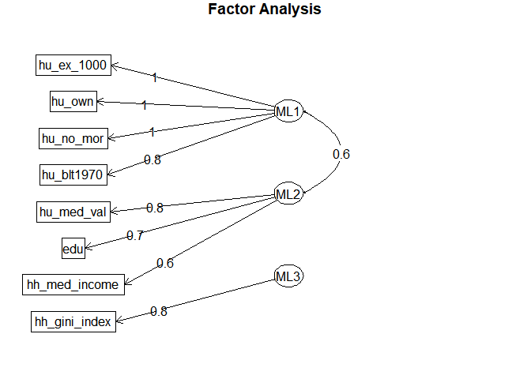

## Factor correlation for solar installation

> The most loaded, `ML1` is positively correlated with the solar installation variable.


```
## [1] 131   3
```

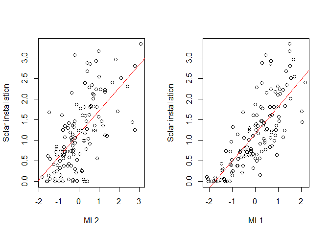

## Factor regression

> The value of R-squared of the factor regression is the same as the previous OLS **(0.61)**.


```
## 
## Call:
## lm(formula = regrs[[14]] ~ dat[, 1] + dat[, 2] + dat[, 3])
## 
## Residuals:
##     Min      1Q  Median      3Q     Max 
## -8.4394 -1.6916 -0.5028  1.0860 16.2534 
## 
## Coefficients:
##             Estimate Std. Error t value Pr(>|t|)    
## (Intercept)   5.0904     0.2531  20.112   <2e-16 ***
## dat[, 1]      3.3447     0.3443   9.715   <2e-16 ***
## dat[, 2]      0.6351     0.3127   2.031   0.0443 *  
## dat[, 3]      0.3905     0.3147   1.241   0.2169    
## ---
## Signif. codes:  0 '***' 0.001 '**' 0.01 '*' 0.05 '.' 0.1 ' ' 1
## 
## Residual standard error: 2.897 on 127 degrees of freedom
## Multiple R-squared:  0.6106,	Adjusted R-squared:  0.6014 
## F-statistic: 66.39 on 3 and 127 DF,  p-value: < 2.2e-16
```


## Cluster within cluster sum of squares (WCSS)

> A cluster analysis was done to further study the featured census tracks. It shows clustering three would be appropriate.

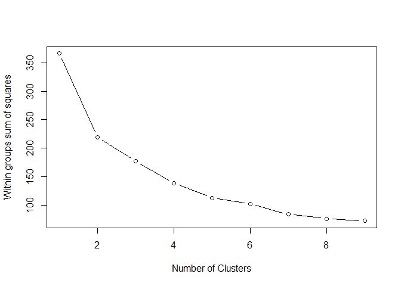


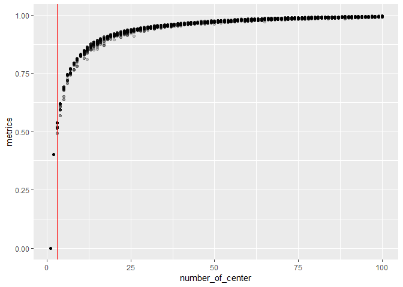

## Cluster analysis


```
## 
##  1  2  3 
## 55 32 44
```

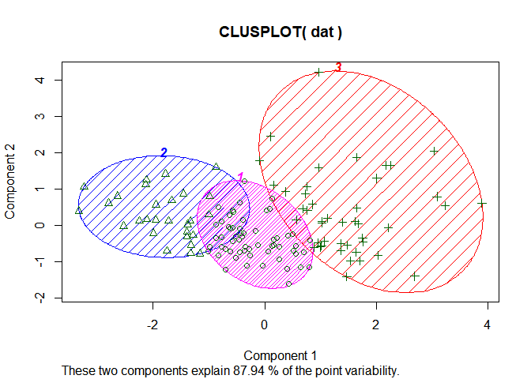

```
## [1] 177.3648
```


## Cluster plot

> Based on the 3 factors, 3 clusters are presented in colors.


## 3D plot


## 3 clusters in Seattle

> 3 clusters were identified with the census track in Seattle.

<center>

{width=450px}

</center>


## Cluster with boxplot

> Each cluster shows unique features. Green groups comparatively have less housing stability and economic status while higher income inequality. Light blue groups are relatively opposite to the green groups. Light red groups keep their position in the middle of these 2 groups.

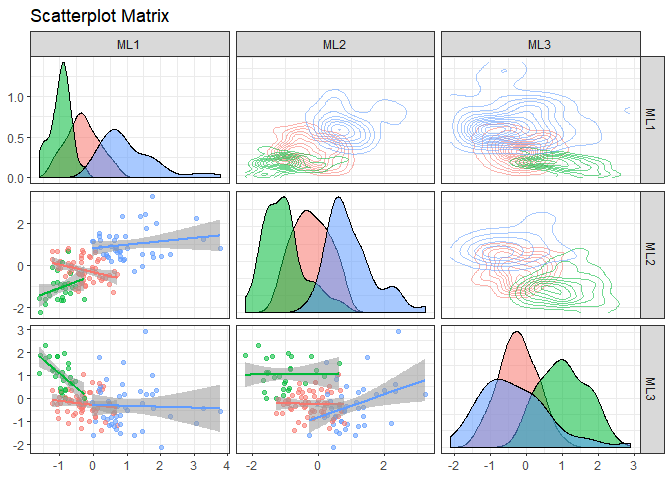

## Cluster plot with smooth

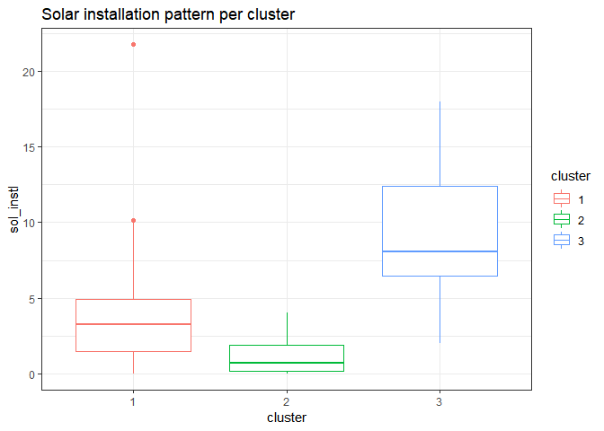

## Residential solar installation pattern in terms of clustering groups

> Residential solar installation is exactly showing the same pattern of the 1st factor (`ML1`), the housing stability in clustering.

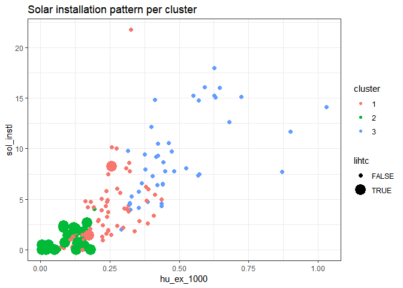


## Residential solar installation in Low Income Tax Credit

> It indicates that lower solar installation rate and lower total number of owner-occupied units with housing costs greater than $1000/month match the certified LIHTC census tracks (TRUE).

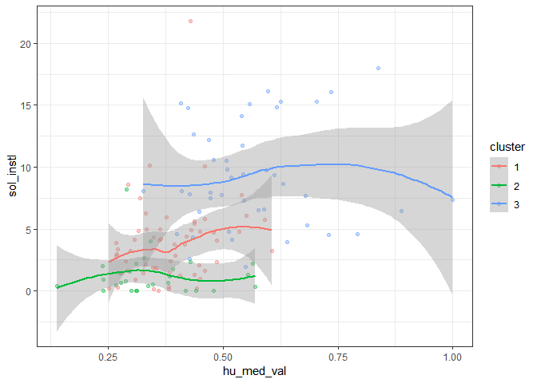

## Residential solar installation in housing unit median value

> Higher solar installation is correlated with higher housing unit median value. Cluster #3, #1 and #2 are in order of higher solar installation.


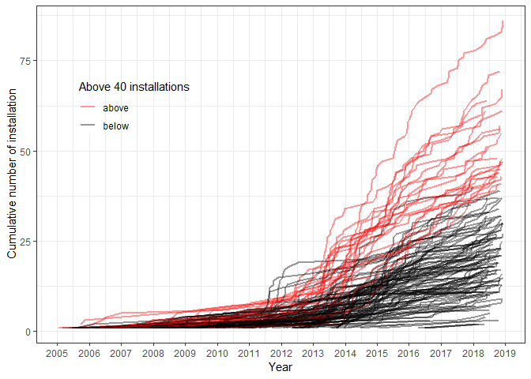


## Cumulative solar installation per census track

> Time series analysis will help to understand the spatial-temporal pattern of residential solar installation in Seattle. Interestingly, one census track is noticeably high in installation over the period.


## Residential solar installation trend in Seattle

> Two different cumulative installation pattern and annual new installation pattern are mapped in each census track in Seattle. It shows cumulative number of installation is different from the annual new installation in that every year had different installation trend depending on census tracks. In addition, hotspot outlier analysis was performed for the annual new installation map.


<center>

{width=650px}

</center>

## Spatial-temporal hotspot analysis

> The difference between cumulative number of installation hotspot and annual new installation hotspot shows the emerging area of increasing installation pattern in residential solar. It is noticeable that West Seattle recently increases the installation while Ballad used to the one but goes slow these days. Columbia city presents both of cases that it has been and still maintaining the higher rate of installation. It's found that these areas are all clustered as light red (#1) and light blue (#3).

<center>

{width=650px}

</center>

<center>

{width=650px}

</center>

## Takeaways

> Residential solar installation follows patterns of

> * Housing median value
> * The number of owner-occupied house with higher housing cost

> Cluster and factor analysis captures solar installation pattern (Cluster #1 and #3) in terms of

> * **Higher housing stability**
> * **Higher economic status**
> * **Lower income inequality**

> Temporal pattern was also captured such that three noticeable areas were identified

> * **Ballad** – used to be a hotspot area, then went slow, currently seems increasing in solar installation
> * **West Seattle** – a new emerging area in solar installation
> * **Columbia city** – has been and currently goes slow. The toal amount installation is still the highest in Seattle. 
