\fontfamily{cmr}
\fontsize{12}{18}
\fontseries{b}
\selectfont


# 1. Seattle solar installation Poisson model


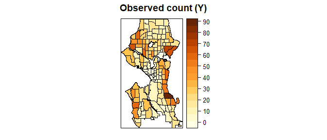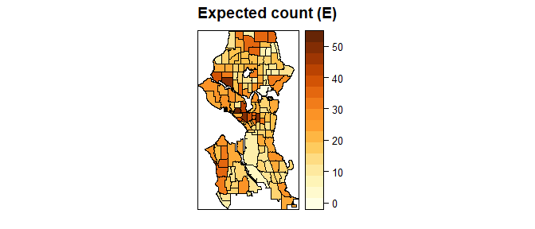

$$ SMR_i = \frac{Y_i}{E_i} $$

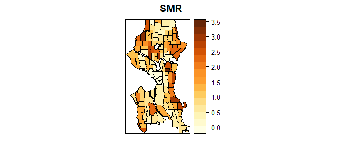

# 2. Poisson-Lognormal-Spatial model

$$
\begin{aligned}
Y_i |\beta_{0},S_i,\epsilon_i & \sim_{ind} \mbox{Poisson}(E_i \mbox{e}^{\beta_{0}+\beta_{1}X_1+\beta_{2}X_2} \mbox{e}^{S_i + \epsilon_i}),\\ 
\epsilon_i | \sigma_\epsilon^{2} & \sim_{iid} \mbox{N}(0,\sigma_\epsilon^{2}),\\ 
S_1,...,S_n | \sigma_s^{2} & \sim ~~~ \mbox{ICAR}(\sigma_s^{2}). 
\end{aligned} 
$$


--------------------------------------------------------------------
       &nbsp;           mean     0.025quant   0.5quant   0.975quant 
-------------------- ---------- ------------ ---------- ------------
  **(Intercept)**      -2.248       -2.6       -2.246      -1.906   

 **I(single_unit)**    1.642        0.77       1.641        2.52    

 **I(hu_med_val)**     2.489       1.415       2.486       3.577    

 **I(hu_ex_1000)**     0.8677     -0.6038      0.8687      2.332    

   **SD for IID**     0.007438    0.02815     0.008871    0.003894  

 **SD for spatial**    0.8086      0.9833      0.8165      0.6753   
--------------------------------------------------------------------

50% chance that the proportion of the spatial variance, $\phi$ is greater 0.5 and 1% chance that the total residual standard deviation is greater than 0.3. 


## BYM2 Model


------------------------------------------------------------------
       &nbsp;          mean    0.025quant   0.5quant   0.975quant 
-------------------- -------- ------------ ---------- ------------
  **(Intercept)**     -2.273     -2.613      -2.271      -1.942   

 **I(single_unit)**   1.636      0.7836      1.635       2.492    

 **I(hu_med_val)**     2.63       1.56       2.627       3.718    

 **I(hu_ex_1000)**    0.8481    -0.5934      0.8487      2.285    

    **Total SD**      0.5548     0.6783      0.5597      0.4637   

   **Phi for ID**     0.9424     0.7732      0.9624      0.9976   
------------------------------------------------------------------

* 2.2645061 - 50% increase in the percentage in single unit may incur the amount increase in solar installation. 
* 3.466117 - 50% increase in the percentage in house unit median value may incur the amount increase in solar installation. 
* 1.5439506 - 50% increase in the percentage in homeownership with more than $1,000 expenditure may incur the amount increase in solar installation. 

## (b) Relative risk estimates and comparison

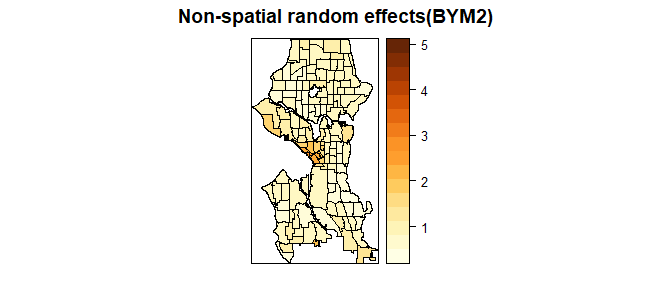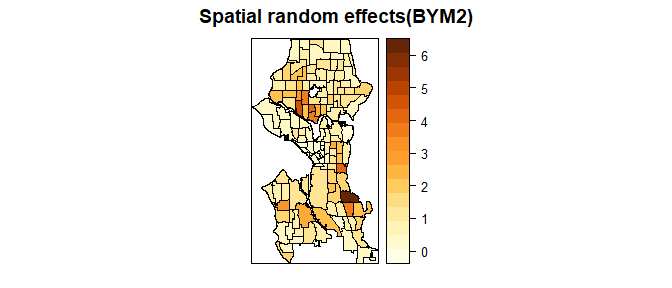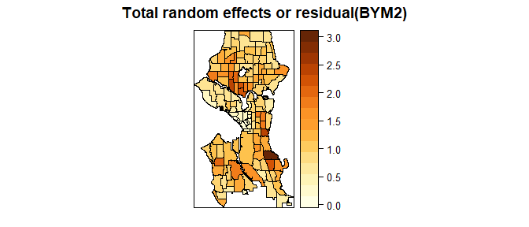

> Can I consider the total random effects to be residuals? 

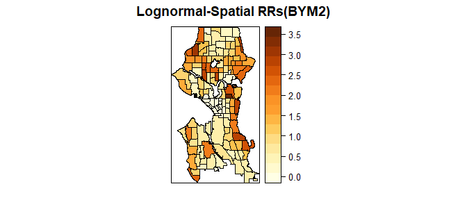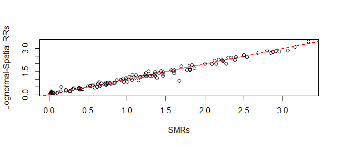

# 3. Clustering 

$$
\begin{aligned}
Y_i \sim \mbox{Poisson}(E_i \mbox{e}^{\beta_{0}})
\end{aligned}
$$

## (a) Clustering of the residual of the poisson model using Moran's


-------------------------------------------------------------------------------
 Test statistic       P value       Alternative hypothesis   Moran I statistic 
---------------- ----------------- ------------------------ -------------------
     8.809        6.327e-19 * * *          greater                0.4706       
-------------------------------------------------------------------------------

Table: Moran I test under randomisation: `seattleres  
weights: col.w    
` (continued below)

 
------------------------
 Expectation   Variance 
------------- ----------
  -0.007463    0.002945 
------------------------

> How can I get residulas from INLA for the moran's I test? 


## (b) Clustering of the residual using Geary's 


-------------------------------------------------------------
 Test statistic       P value        Alternative hypothesis  
---------------- ----------------- --------------------------
     8.759        9.867e-19 * * *   Expectation greater than 
                                           statistic         
-------------------------------------------------------------

Table: Geary C test under randomisation: `seattleres 
weights: col.w 
` (continued below)

 
--------------------------------------------
 Geary C statistic   Expectation   Variance 
------------------- ------------- ----------
      0.5052              1        0.003191 
--------------------------------------------

## (c) Cluster detection based on $Y_i$ count 

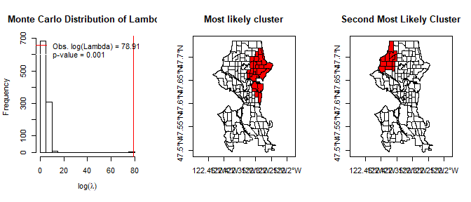

# 4. Point data analysis


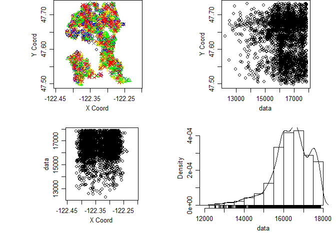

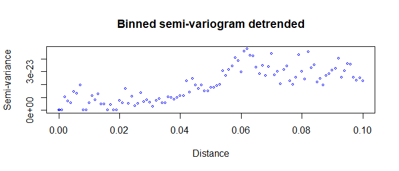

> how to project to the different coordinates? how to address the very small variance cos I can't test any regressions on it such as MLE.
## (b) Monte Carlo intervals 


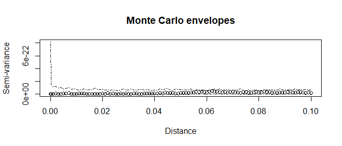

## 5. Regression - Moran's test 


------------------------------------------------------------------------------
 Test statistic       P value       Alternative hypothesis   Observed Moran I 
---------------- ----------------- ------------------------ ------------------
     4.779        1.764e-06 * * *         two.sided               0.2362      
------------------------------------------------------------------------------

Table: Global Moran I for regression residuals: `
model: lm(formula = SMR_s ~ single_unit + hu_med_val + hu_ex_1000,
data = seattle@data)
weights: col.w
` (continued below)

 
------------------------
 Expectation   Variance 
------------- ----------
  -0.01732     0.002815 
------------------------


------------------------------------------------------------------------------
 Test statistic       P value       Alternative hypothesis   Observed Moran I 
---------------- ----------------- ------------------------ ------------------
     6.343        2.257e-10 * * *         two.sided               0.3558      
------------------------------------------------------------------------------

Table: Global Moran I for regression residuals: `
model: glm(formula = n_s ~ single_unit + hu_med_val + hu_ex_1000 +
offset(log(solar_E)), family = "poisson", data = seattle@data)
weights: col.w
` (continued below)

 
------------------------
 Expectation   Variance 
------------- ----------
 -0.0009297    0.003163 
------------------------


------------------------------------------------------------------------------
 Test statistic      P value       Alternative hypothesis   Moran I statistic 
---------------- ---------------- ------------------------ -------------------
     4.521        3.08e-06 * * *          greater                0.2362       
------------------------------------------------------------------------------

Table: Moran I test under randomisation: `seattleres  
weights: col.w    
` (continued below)

 
------------------------
 Expectation   Variance 
------------- ----------
  -0.007463    0.002905 
------------------------


-------------------------------------------------------------------------------
 Test statistic       P value       Alternative hypothesis   Moran I statistic 
---------------- ----------------- ------------------------ -------------------
     6.166        3.498e-10 * * *          greater                0.3243       
-------------------------------------------------------------------------------

Table: Moran I test under randomisation: `seattlegres  
weights: col.w    
` (continued below)

 
------------------------
 Expectation   Variance 
------------- ----------
  -0.007463    0.002895 
------------------------

## 6. Spatial regression - Moran's test 

### lagsar


```
## 
## Call:lagsarlm(formula = SMR_s ~ single_unit + hu_med_val + hu_ex_1000, 
##     data = seattle@data, listw = col.w)
## 
## Residuals:
##       Min        1Q    Median        3Q       Max 
## -1.360760 -0.298758 -0.035265  0.218166  1.524414 
## 
## Type: lag 
## Coefficients: (asymptotic standard errors) 
##             Estimate Std. Error z value  Pr(>|z|)
## (Intercept) -0.83317    0.13433 -6.2025 5.557e-10
## single_unit  0.59642    0.35302  1.6895  0.091122
## hu_med_val   2.02468    0.52699  3.8420  0.000122
## hu_ex_1000   1.85168    0.65000  2.8487  0.004389
## 
## Rho: 0.31696, LR test value: 13.459, p-value: 0.0002438
## Asymptotic standard error: 0.083652
##     z-value: 3.789, p-value: 0.00015123
## Wald statistic: 14.357, p-value: 0.00015123
## 
## Log likelihood: -87.7104 for lag model
## ML residual variance (sigma squared): 0.21012, (sigma: 0.45839)
## Number of observations: 135 
## Number of parameters estimated: 6 
## AIC: 187.42, (AIC for lm: 198.88)
## LM test for residual autocorrelation
## test value: 2.6691, p-value: 0.10231
```


-----------------------------------------------------------------------
 Test statistic   P value   Alternative hypothesis   Moran I statistic 
---------------- --------- ------------------------ -------------------
     1.288        0.09887          greater                0.06195      
-----------------------------------------------------------------------

Table: Moran I test under randomisation: `residuals(spmod, type = "pearson")  
weights: col.w    
` (continued below)

 
------------------------
 Expectation   Variance 
------------- ----------
  -0.007463    0.002904 
------------------------

### stsls


```
## 
## Call:stsls(formula = SMR_s ~ single_unit + hu_med_val + hu_ex_1000, 
##     data = seattle@data, listw = col.w)
## 
## Residuals:
##       Min        1Q    Median        3Q       Max 
## -1.340087 -0.300259 -0.022753  0.219727  1.547746 
## 
## Coefficients: 
##             Estimate Std. Error t value  Pr(>|t|)
## Rho          0.27406    0.11812  2.3202 0.0203299
## (Intercept) -0.83128    0.13735 -6.0523 1.428e-09
## single_unit  0.64770    0.37468  1.7287 0.0838637
## hu_med_val   2.12063    0.58536  3.6228 0.0002915
## hu_ex_1000   1.82263    0.66952  2.7223 0.0064833
## 
## Residual variance (sigma squared): 0.21989, (sigma: 0.46893)
```

```
## Impact measures (lag, exact):
##                Direct  Indirect     Total
## single_unit 0.6100936 0.2630940 0.8731876
## hu_med_val  2.0710948 0.8931295 2.9642243
## hu_ex_1000  1.8941239 0.8168134 2.7109373
```


-------------------------------------------------------------------------
 Test statistic    P value    Alternative hypothesis   Moran I statistic 
---------------- ----------- ------------------------ -------------------
     1.719        0.04281 *          greater                0.08516      
-------------------------------------------------------------------------

Table: Moran I test under randomisation: `residuals(sp2mod, type = "pearson")  
weights: col.w    
` (continued below)

 
------------------------
 Expectation   Variance 
------------- ----------
  -0.007463    0.002904 
------------------------

### errorsar


```
## 
## Call:errorsarlm(formula = SMR_s ~ single_unit + hu_med_val + hu_ex_1000, 
##     data = seattle@data, listw = col.w)
## 
## Residuals:
##      Min       1Q   Median       3Q      Max 
## -1.23141 -0.25942 -0.03261  0.22694  1.56976 
## 
## Type: error 
## Coefficients: (asymptotic standard errors) 
##             Estimate Std. Error z value  Pr(>|z|)
## (Intercept) -0.67302    0.17159 -3.9222 8.774e-05
## single_unit  0.90357    0.37720  2.3955 0.0165993
## hu_med_val   2.07205    0.59388  3.4890 0.0004849
## hu_ex_1000   1.87189    0.65992  2.8365 0.0045604
## 
## Lambda: 0.4769, LR test value: 16.945, p-value: 3.8483e-05
## Asymptotic standard error: 0.098309
##     z-value: 4.851, p-value: 1.2284e-06
## Wald statistic: 23.532, p-value: 1.2284e-06
## 
## Log likelihood: -85.96762 for error model
## ML residual variance (sigma squared): 0.19853, (sigma: 0.44556)
## Number of observations: 135 
## Number of parameters estimated: 6 
## AIC: 183.94, (AIC for lm: 198.88)
```


-----------------------------------------------------------------------
 Test statistic   P value   Alternative hypothesis   Moran I statistic 
---------------- --------- ------------------------ -------------------
   -0.007851      0.5031           greater               -0.007886     
-----------------------------------------------------------------------

Table: Moran I test under randomisation: `residuals(err, type = "pearson")  
weights: col.w    
` (continued below)

 
------------------------
 Expectation   Variance 
------------- ----------
  -0.007463    0.002906 
------------------------

### GWR


```
##    ***********************************************************************
##    *                       Package   GWmodel                             *
##    ***********************************************************************
##    Program starts at: 2019-03-12 01:09:10 
##    Call:
##    gwr.basic(formula = SMR_s ~ single_unit + hu_med_val + hu_ex_1000, 
##     data = seattle, bw = bw.ans, kernel = "bisquare")
## 
##    Dependent (y) variable:  SMR_s
##    Independent variables:  single_unit hu_med_val hu_ex_1000
##    Number of data points: 135
##    ***********************************************************************
##    *                    Results of Global Regression                     *
##    ***********************************************************************
## 
##    Call:
##     lm(formula = formula, data = data)
## 
##    Residuals:
##     Min      1Q  Median      3Q     Max 
## -1.4752 -0.3174 -0.0517  0.2479  1.6968 
## 
##    Coefficients:
##                Estimate Std. Error t value Pr(>|t|)    
##    (Intercept)  -0.8192     0.1447  -5.661 9.08e-08 ***
##    single_unit   0.9753     0.3659   2.665  0.00866 ** 
##    hu_med_val    2.7336     0.5508   4.963 2.11e-06 ***
##    hu_ex_1000    1.6371     0.7009   2.336  0.02102 *  
## 
##    ---Significance stars
##    Signif. codes:  0 '***' 0.001 '**' 0.01 '*' 0.05 '.' 0.1 ' ' 1 
##    Residual standard error: 0.4944 on 131 degrees of freedom
##    Multiple R-squared: 0.6633
##    Adjusted R-squared: 0.6556 
##    F-statistic: 86.02 on 3 and 131 DF,  p-value: < 2.2e-16 
##    ***Extra Diagnostic information
##    Residual sum of squares: 32.02475
##    Sigma(hat): 0.4907011
##    AIC:  198.88
##    AICc:  199.3451
##    ***********************************************************************
##    *          Results of Geographically Weighted Regression              *
##    ***********************************************************************
## 
##    *********************Model calibration information*********************
##    Kernel function: bisquare 
##    Fixed bandwidth: 0.05907508 
##    Regression points: the same locations as observations are used.
##    Distance metric: Euclidean distance metric is used.
## 
##    ****************Summary of GWR coefficient estimates:******************
##                    Min.  1st Qu.   Median  3rd Qu.    Max.
##    Intercept   -2.36104 -1.24462 -0.62232 -0.34915  1.0219
##    single_unit -6.55438  0.48397  1.32156  2.19765  6.5677
##    hu_med_val  -1.71636  0.96406  2.54644  4.78920 16.3447
##    hu_ex_1000  -9.47302  0.63698  1.24784  2.05757 11.9672
##    ************************Diagnostic information*************************
##    Number of data points: 135 
##    Effective number of parameters (2trace(S) - trace(S'S)): 40.994 
##    Effective degrees of freedom (n-2trace(S) + trace(S'S)): 94.006 
##    AICc (GWR book, Fotheringham, et al. 2002, p. 61, eq 2.33): 180.6732 
##    AIC (GWR book, Fotheringham, et al. 2002,GWR p. 96, eq. 4.22): 122.828 
##    Residual sum of squares: 15.41753 
##    R-square value:  0.8378957 
##    Adjusted R-square value:  0.7664454 
## 
##    ***********************************************************************
##    Program stops at: 2019-03-12 01:09:10
```


-----------------------------------------------------------------------
 Test statistic   P value   Alternative hypothesis   Moran I statistic 
---------------- --------- ------------------------ -------------------
     1.554        0.06012          greater                0.07633      
-----------------------------------------------------------------------

Table: Moran I test under randomisation: `gwr.res$SDF@data$residual  
weights: col.w    
` (continued below)

 
------------------------
 Expectation   Variance 
------------- ----------
  -0.007463    0.002908 
------------------------

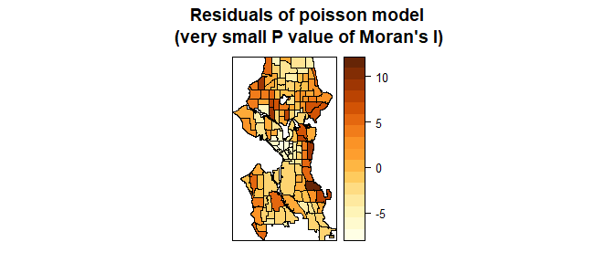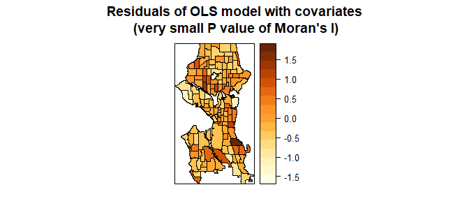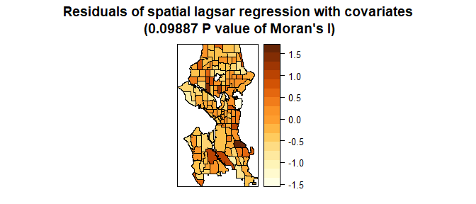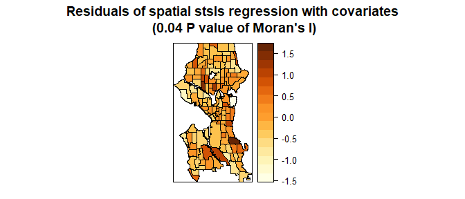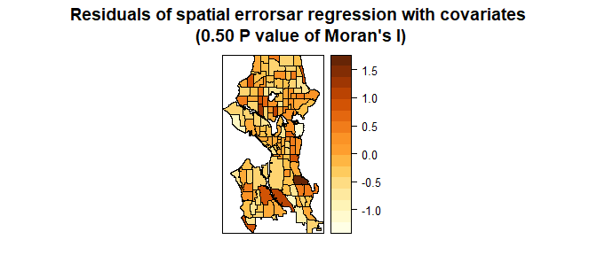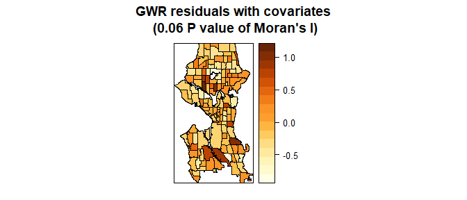
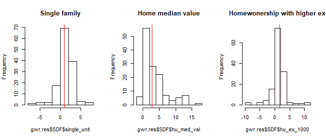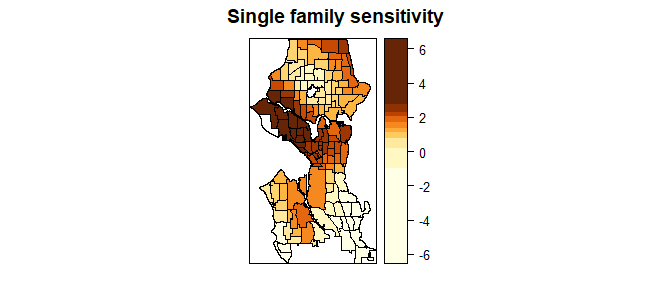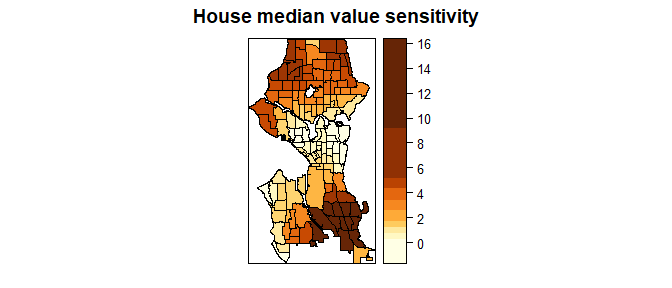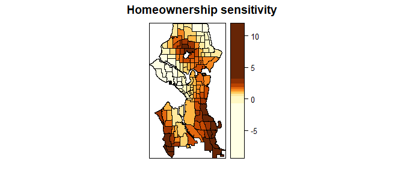

## 7. Analysis in detail

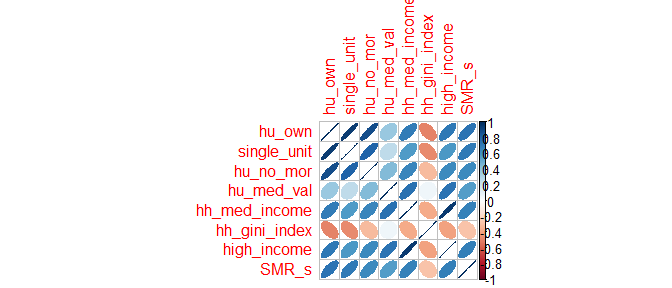

### Factor analysis

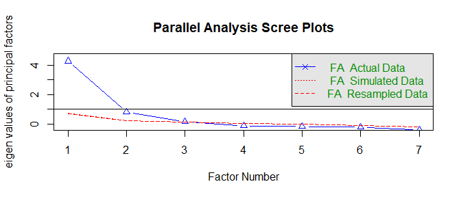

```
## Parallel analysis suggests that the number of factors =  2  and the number of components =  NA
```

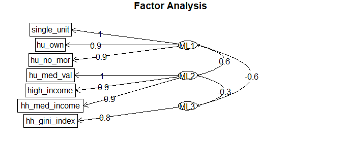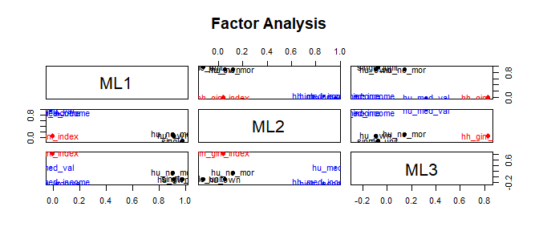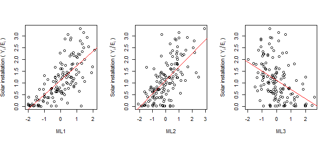

### regression 


------------------------------------------------------------
    term       estimate   std.error   statistic    p.value  
------------- ---------- ----------- ----------- -----------
 (Intercept)     1.12      0.0452       24.79     1.682e-51 

  dat[, 1]      0.4363     0.05666       7.7      2.844e-12 

  dat[, 2]      0.3076     0.05727      5.371     3.431e-07 
------------------------------------------------------------


----------------------------------------------------------------
     &nbsp;        Estimate   Std. Error   z value    Pr(>|z|)  
----------------- ---------- ------------ --------- ------------
 **(Intercept)**   -0.1145     0.02038     -5.615    1.965e-08  

  **dat[, 1]**      0.5227     0.02451      21.33    6.585e-101 

  **dat[, 2]**      0.183      0.02243      8.157    3.424e-16  
----------------------------------------------------------------

Table: Fitting generalized (poisson/log) linear model: seattle@data[["n_s"]] ~ offset(log(seattle@data[["solar_E"]])) + dat[, 1] + dat[, 2]


-------------------------------------------------------------------------------
 Test statistic       P value       Alternative hypothesis   Moran I statistic 
---------------- ----------------- ------------------------ -------------------
     5.356        4.254e-08 * * *          greater                0.2814       
-------------------------------------------------------------------------------

Table: Moran I test under randomisation: `residuals(falm, type = "pearson")  
weights: col.w    
` (continued below)

 
------------------------
 Expectation   Variance 
------------- ----------
  -0.007463    0.002908 
------------------------


-------------------------------------------------------------------------------
 Test statistic       P value       Alternative hypothesis   Moran I statistic 
---------------- ----------------- ------------------------ -------------------
     7.181        3.462e-13 * * *          greater                0.3794       
-------------------------------------------------------------------------------

Table: Moran I test under randomisation: `residuals(faglm, type = "pearson")  
weights: col.w    
` (continued below)

 
------------------------
 Expectation   Variance 
------------- ----------
  -0.007463    0.002903 
------------------------

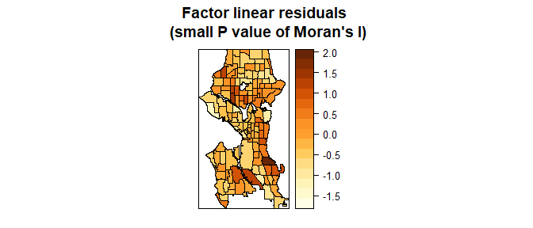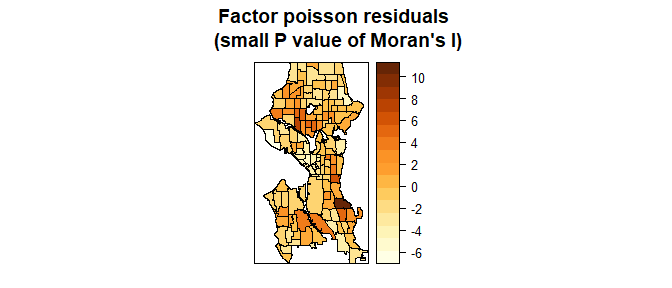

> How can I use lagsar, stsls, errorsar and gwr for poisson model? 

### cluster analysis

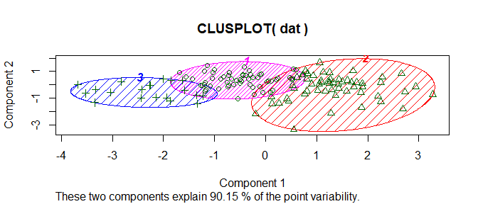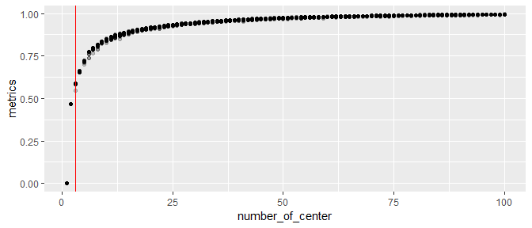

### regression 


------------------------------------------------------------
    term       estimate   std.error   statistic    p.value  
------------- ---------- ----------- ----------- -----------
 (Intercept)   -0.8192     0.1447      -5.661     9.085e-08 

 single_unit    0.9753     0.3659       2.665      0.00866  

 hu_med_val     2.734      0.5508       4.963     2.115e-06 

 hu_ex_1000     1.637      0.7009       2.336      0.02102  
------------------------------------------------------------


----------------------------------------------------------------
     &nbsp;        Estimate   Std. Error   z value    Pr(>|z|)  
----------------- ---------- ------------ --------- ------------
 **(Intercept)**    -1.996     0.07035     -28.37    4.925e-177 

 **single_unit**    1.962       0.1784       11      3.799e-28  

 **hu_med_val**     2.324       0.2168      10.72    8.004e-27  

 **hu_ex_1000**     0.2955      0.3177     0.9302      0.3523   
----------------------------------------------------------------

Table: Fitting generalized (poisson/log) linear model: n_s ~ single_unit + hu_med_val + hu_ex_1000 + offset(log(solar_E))

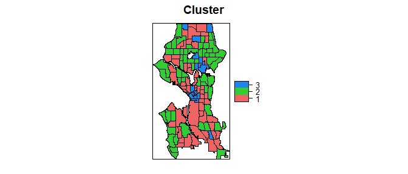

```
## [[1]]
## [[1]][[1]]
```

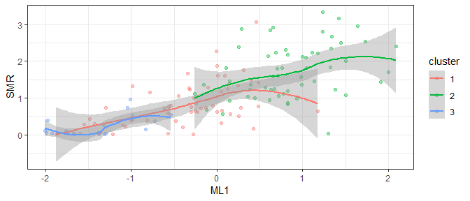

```
## 
## [[1]][[2]]
```

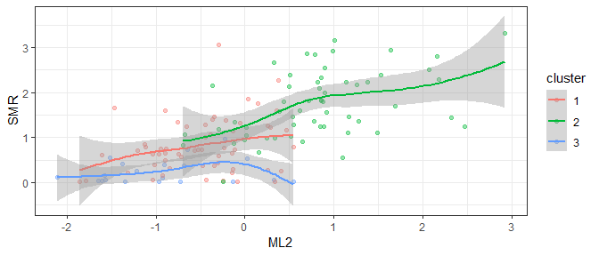

```
## 
## [[1]][[3]]
```

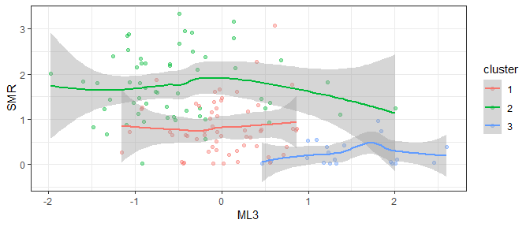

```
## 
## 
## [[2]]
```

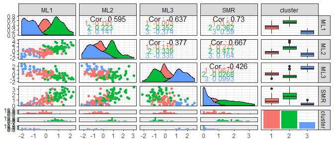

```
## 
## [[3]]
```


```
## [[1]]
```


```
## 
## [[2]]
## [[2]][[1]]
```


```
## 
## [[2]][[2]]
```

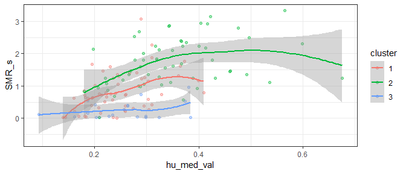

```
## 
## [[2]][[3]]
```

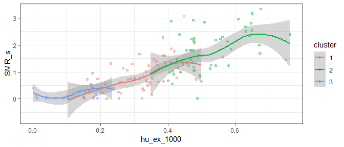


---
title: "inla.R"
author: "Yohan_Min"
date: "Tue Mar 12 01:08:15 2019"
---
