\fontfamily{cmr}
\fontsize{11}{16}
\fontseries{b}
\selectfont

# 1. INTRODUCTION

Residential solar installations have rapidly increased in recent years with advancement of clean energy policies and associated incentives such as tax credits. This transition to the new energy system could lead to undesirable effects on some communities as shown in the case of telecommunication (Caperton et al. 2013). Committed leadership to implement a new policy in regard to the transition is required to avoid the uneven distribution of the service. While numerous studies have been performed on various aspects of the policies designed to support solar installations, there is still a dearth of studies aimed at investigating the impact of such policies on the social equity. Two unanswered questions have emerged: (1) were there certain communities inadvertently left out from incentive opportunities? and (2) do those current policies help the social equity?

To answer these questions, the present study performs a spatial analysis of the distribution of solar panel installed-buildings (residential solar hereafter) in terms of housing and socioeconomic characteristics based on census track in Seattle. In particular, this study aims to explore any patterns of residential (single family and multifamily) solar installations by examining spatial clustering patterns, associations among variables through several data sources.

# 2. DATA DESCRIPTION

City of Seattle open data portal keeps the records of electrical permits and this study focuses on the data that were issued between 2003 and 2018 in Seattle, WA. Electrical permits are required when residential houses want to install solar systems on their house properties. Intensive data mining techniques made it possible to identify residential solar installation permits among the data sets. The data includes geographical coordinates (latitude and longitude), completion of installation dates of the solar system, and solar contractor who installed the system. Mapping the points of residential solar in the region can verify a certain pattern in installation. Residential housing units can be assumed to be evenly present across the region for the purpose of exploratory data analysis although they are not equally distributed. The density of point data of residential solar and its related `G estimate` show a clustered pattern.

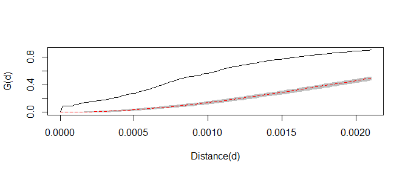

G estimate for spatial dependency of solar installations

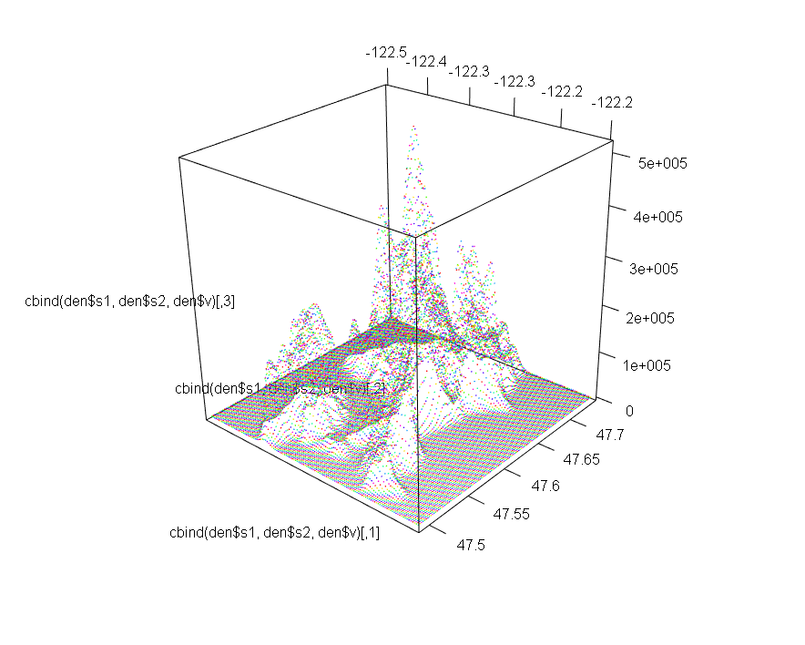{width=500px}

Residential housing density in Seattle

After the point data was aggregated to the related census track, the data was examined in terms of the socioeconomic and housing characteristics based on the American Community Survey of the census (2011 - 2015 ACS 5-Year estimates). The rate of the residential solar installation in each census track is the dependent variable (`SMR_s`) in this study. Rest of variables are as follows.

* `hu_own`: owner-occupied housing units
* `single_unit`: single unit housings (single family houses)
* `hu_no_mor`: owner-occupied housing units without a mortgage
* `hu_med_val`: median value of owner-occupied housing units
* `edu`: population above high school degree
* `hh_med_income`: household median income
* `hh_gini_index`: household GINI Index of income inequality
* `high_income`: high income households
* `SMR_s`: the ratio of solar installation to the expected number of installations in regard to the total number of the residential housing units of the given census track.

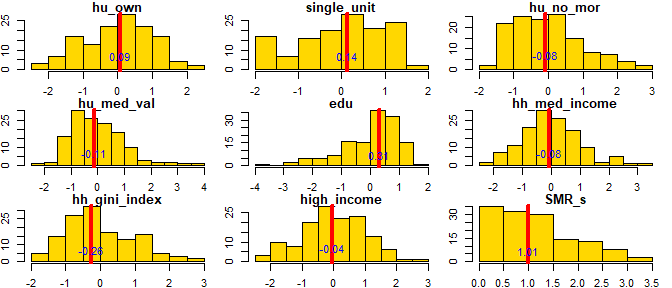

Histograms of variables

# 3. METHODS

The expected rate of residential solar per each census track is estimated based on the total number of housing units in Seattle and its residential solar numbers. Here the term, Standardized Mortality Ratio (SMR) can be considered to be the rate of residential solar in a census track in this study. It is defined by the number of residential solar over the expected number of residential solar given the estimated proportion, which is the total number of residential solar over the total number of housing units in Seattle. SMR shows a pattern of clustering similar to the pattern of the previous point data of residential solar.

$$ SMR_i = \frac{Y_i}{E_i} $$

The residential solar rate is assumed to be associated with `poisson count model` considering its rare proportion with respect to the denominator (the total housing units) in a census track in addition to the fact that the number of residential solar is count data. The residuals, after fitting the poisson model, shows clustering with the similar pattern of SMR distribution across census tracks as shown in the figures below. This indicates that there is strong evidence of spatial dependency among the regions in Seattle.
$$
\begin{aligned}
Y_i \sim \mbox{Poisson}(E_i \mbox{e}^{\beta_{0}})
\end{aligned}
$$

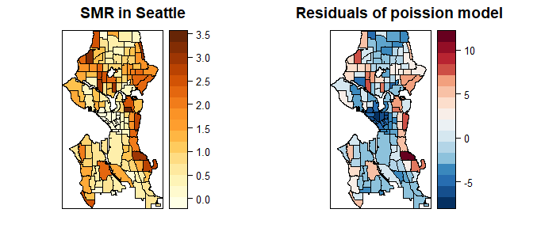

SMR and residuals of poisson model

Moran's I test detects global clustering in the distribution of the rate of residential solar with very small `p-value`. This confirms that the residential solar rate across census tracks is clustered. Using `SatScan method`, area clustering detection shows Northwest Seattle and Northeast Seattle as the clustered regions. This clustering trend can be alleviated by fitting a model with appropriate covariates showing the similar characteristics. In this regard, socioeconomic and housing characteristics will be examined to identify the most proper covariates.

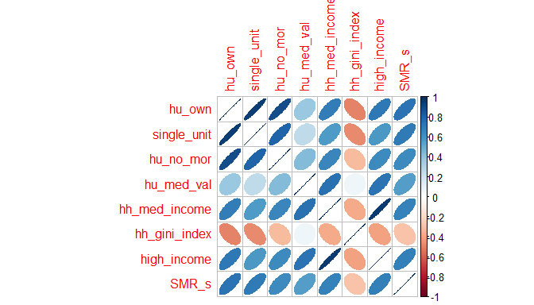

StaScan clustering detection

Having verified that there is a spatial pattern in the residential solar rate, there might be related or shared factors in socioeconomic and housing characteristics in the same region. Housing, economy, social inequality variables show correlations pairwise in the figure below.

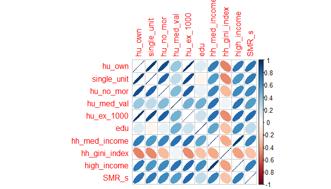

Covariates correlation plot

Dimension reduction of covariates will be performed by factor analysis in consideration of avoiding multicollinearity. The newly generated factors will fit models to estimate the residential solar rate. Residuals will be checked afterwards to see if there is still a clustering pattern, which indicates that the model can't address the spatial dependency. Furthermore, a few variables which represent each factor the most, will be chosen for the model fit compared to the factors from dimension reduction. It is because factors could possibly keep overall noises by including unnecessary covariates, which are less related to the residential solar rate. Poisson lognormal spatial model, specially using `BYM2` method, will be tested to address the residual clustering issue in addition to `K-means` clustering analysis, which identifies similar regions in terms of socioeconomic and housing patterns of census tracks. Note that `K-means` clustering will not take into account of the residential solar rate for defining the Euclidean distance among data points in order for the categorized census tracks to be compared with the residential solar rate pattern to figure out the relationship between the covariates and residential solar rate. Finally Geographically Weighted Regression (GWR) will address the local variation of coefficients of covariates by taking into account of the local spatial dependency.

# 4. RESULTS

## 4.1. Factor analysis

Factor analysis was performed to reduce dimension of variables in accordance with variables representing similar characteristics, mostly correlated each other. It identifies the similar variables in terms of housing unit structure (single/ multi-family house unit), housing tenure (rent/ owns), economic status (income level and housing value), and inequality index. Housing unit structure shows the similar trend of housing tenure while housing median value, high income class proportion, and household median income follow the similar pattern representing economic status. Residential solar rate and the factors from the dimension reduction, show strong correlations. Generalized log-linear model was fitted to the data.

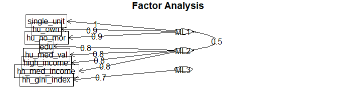

Factor diagram

----------------------------------------------------------------
     &nbsp;        Estimate   Std. Error   z value    Pr(>|z|)  
----------------- ---------- ------------ --------- ------------
 **(Intercept)**   -0.1107     0.02038     -5.432    5.588e-08  

     **ML1**        0.5678     0.02233      25.43    1.132e-142 

     **ML2**        0.1451      0.0216      6.718    1.843e-11  
----------------------------------------------------------------

Table: Fitting generalized (poisson/log) linear model: n_s ~ ML1 + ML2 + offset(log(solar_E))

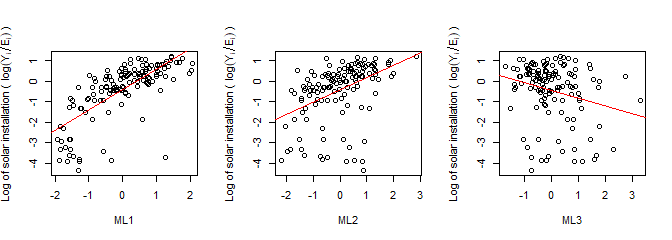

SMR plots in factors

## 4.2. Integrated Nested Laplace Approximations (INLA) model

It is obvious that the variables can be divided into three categories: (1) housing stability, mostly the proportion of owner occupied single family houses, (2) economic status such as income level and house value, and (3) income inequality. Solar installation rate seems to be mainly correlated to the housing stability and economic status in this data. A few selected covariates could fit a model better than factors due to the fact that factors include all the unrelated covariates to the dependent variable (residential solar rate) in this study. The most representing covariates are single family house proportion (housing stability) and house median value (economic status) and selected for the further analyses. It is verified that the same generalized loglinear model fits better with the two covariates than factors.

$$
\begin{aligned}
Y_i |\beta_{0},\beta_{1},\beta_{2},S_i,\epsilon_i & \sim_{ind} \mbox{Poisson}(E_i \mbox{e}^{\beta_{0}+\beta_{1}I_{1i}+\beta_{2}I_{2i}} \mbox{e}^{S_i + \epsilon_i}),\\ 
\epsilon_i | \sigma_\epsilon^{2} & \sim_{iid} \mbox{N}(0,\sigma_\epsilon^{2}),\\ 
S_1,...,S_n | \sigma_s^{2} & \sim ~~~ \mbox{ICAR}(\sigma_s^{2}). 
\end{aligned} 
$$

Integrated Nested Laplace Approximations (INLA) model takes into account of spatial dependencies and lognormal independent variance across census tracks. This model was set with priors such that 50% chance that the proportion of the spatial variance, $\phi$ is greater 0.5 and 1% chance that the total residual standard deviation is greater than 0.9. The result of the model fit confirms that the large variance is due to the spatial factor with $\phi$ of 0.96 in median.

----------------------------------------------------------------------
        &nbsp;            mean     0.025quant   0.5quant   0.975quant 
----------------------- --------- ------------ ---------- ------------
    **(Intercept)**      -0.3031    -0.3624     -0.3028     -0.2455   

      **I(ML1)**         0.5549      0.4107      0.5548      0.6995   

      **I(ML2)**          0.182      0.0429      0.1816      0.3232   

 **Total residual sd**    0.662      0.8032      0.6676      0.5564   

    **Phi for ID**       0.9611      0.8347      0.9765      0.9988   
----------------------------------------------------------------------

Table: Fitting INLA model: n_s ~ offset(log(solar_E)) + ML1 + ML2

Even though this model considers the spatial dependency, the residuals for the model show a clustering pattern after eliminating the covariate terms from the fitted values.

## 4.3. K-means clustering analysis

K-means cluster analysis indicates a group of census tracks with the similar characteristics which helps to identify the correlations between concerned covariates and the dependent variable (residential solar rate). Three groups are categorized with the census tracks in Seattle. The clustering pattern is evident with respect to the covariates, house median value and the proportion of single family house units.

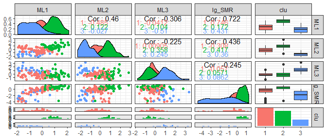

Covariate distributions with clustering

## 4.4. Geographically Weighted Regression

Geographically Weighted Regression (GWR) model finally confirms that the residuals of the model have less chance of spatial dependency with respect to the insignificant `p-value` of Moran's I in 0.05 significance level. This model has even higher `R-squared` value compared to the previous models. GWR model entails consideration of spatial dependence in a local level by changing the coefficient values of covariates without involvement of explicit spatial term to the model. Below figures show the variance of coefficient values across the census tracks. The intensity of each map of covariates indicates the sensitivity of the concerned covariate in terms of the rate of residential solar. Single family house rate impacts more on the central Seattle area while North and South Seattle are more sensitive to the house median value with respect to solar panel installation on the residential houses.

$$
\begin{aligned}
Y(s) = E(s)\mbox{e}^{(\beta_{0}+\beta_{1}(s)X_1(s)+\beta_{2}(s)X_2(s)+\epsilon(s))}
\end{aligned} 
$$

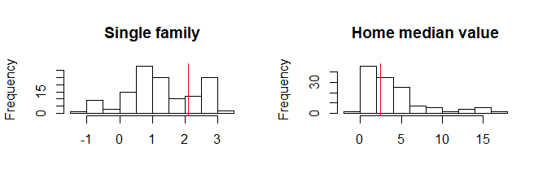

Clustering and GWR residuals

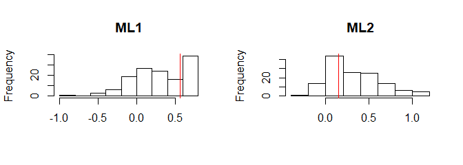

Coefficient variation of covariates

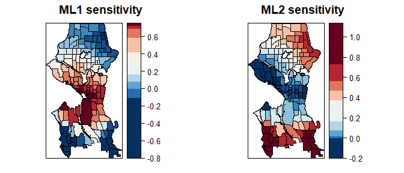

GWR different impact of covariates in Seattle

# 5. DISCUSSION AND CONCLUSION

The previous analyses reveal that (1) residential solar installations are mostly correlated to housing stability (single family house unit and housing tenure) and economic status (income level and house value) (2) income inequality across census tracks is less likely correlated. The results answer the questions that there are certain communities left out from using renewable energy due to the lack of resources (i.e., housing and finance). Since these communities are hard to join the incentivized programs such as 30% federal tax credits, it is necessary to address the issue by coming up with policies such that encouraging the underserved communities to take advantage of the clean energy as well. In addition, cluster and GWR model with respect to the residential solar were analyzed to find areas in Seattle more influenced by each characteristic. As a result, three categorized groups in terms of housing stability and economic status were identified in addition to areas in Seattle where residential solar installations are more sensitive to the economic status and the housing stability.

The study results will support policy makers to develop a policy that better help underserved communities under limited resources (e.g., those who rent multi-family houses and have less finance to install solar systems) by leading to equitable incentive distribution and access to clean energy.

# REFERENCE

Caperton, Richard W., Mari Hern, and ez. “The Electrical Divide: New Energy Technologies and Avoiding an Electric Service Gap.” Center for American Progress. Accessed December 24, 2018. https://www.americanprogress.org/issues/green/reports/2013/07/15/69249/the-electrical-divide-new-energy-technologies-and-avoiding-an-electric-service-gap/.

\pagebreak

# APPENDIX

-------------------------------------------------------------------------------
 Test statistic       P value       Alternative hypothesis   Moran I statistic 
---------------- ----------------- ------------------------ -------------------
     8.809        6.327e-19 * * *          greater                0.4706       
-------------------------------------------------------------------------------

Table: Residuals of poisson model without covariates (continued below)

 
------------------------
 Expectation   Variance 
------------- ----------
  -0.007463    0.002945 
------------------------

-------------------------------------------------------------------------------
 Test statistic       P value       Alternative hypothesis   Moran I statistic 
---------------- ----------------- ------------------------ -------------------
     7.214        2.725e-13 * * *          greater                0.3811       
-------------------------------------------------------------------------------

Table: Residuals of poission model with covariates (continued below)

 
------------------------
 Expectation   Variance 
------------- ----------
  -0.007463    0.002902 
------------------------

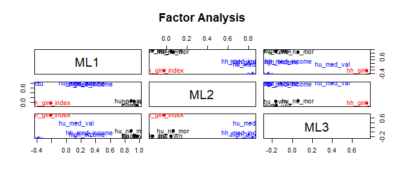

Factors in tersm of covariates

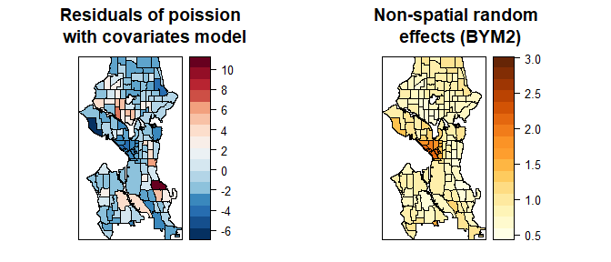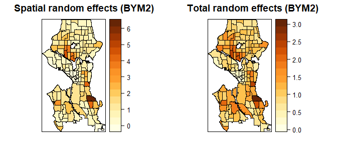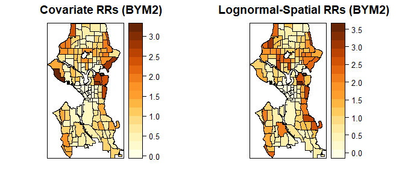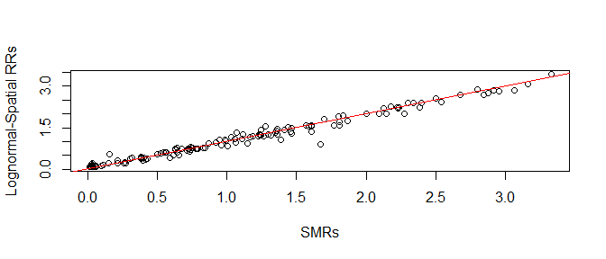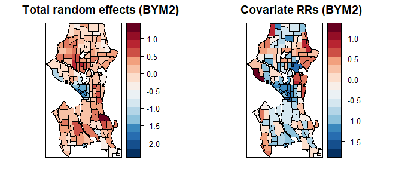

Mapping of random effects and residuals

-------------------------------------------------------------------------------
 Test statistic       P value       Alternative hypothesis   Moran I statistic 
---------------- ----------------- ------------------------ -------------------
      3.49        0.0002416 * * *          greater                0.1783       
-------------------------------------------------------------------------------

Table: GWR residual residuals (continued below)

 
------------------------
 Expectation   Variance 
------------- ----------
  -0.007463    0.002833 
------------------------

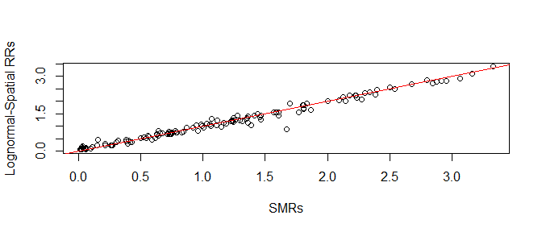

Plot of SMR vs. RR from INLA model

---
title: "stat.R"
author: "Yohan_Min"
date: "Tue Jun 04 15:45:41 2019"
---
